# 核心逻辑流程图

对应的主要实现文件如下：

- `src/application/main.cpp`
- `src/io/io.cpp`
- `src/core/bool_problem.h`
- `src/core/bool_problem.cpp`
- `src/core/subdivision_solver.h`
- `src/core/subdivision_solver.cpp`
- `src/core/leaf_classifier.cpp`
- `src/algorithm/leaf_arrangement.cpp`
- `src/algorithm/path_candidates.h`
- `src/algorithm/path_candidate_details.h`
- `src/algorithm/WNV_tracing.cpp`

## 1. 总体调用链

当前对外流水线是：

```text
OBJ/STL -> 共享 scale + 浮点输入AABB -> Polygon soup -> BoolProblem(校验/懒顶点缓存) -> SubdivisionSolver -> resultFragments -> raw/conforming OBJ n-gon / STL triangles
```

其中职责边界是：

- `main.cpp` 只负责 CLI、按扩展名读写 OBJ/STL、共享量化尺度选择、合并输入 AABB、驱动 `BoolProblem`。
- `BoolProblem` 是公开门面，只保存输入、布尔配置和最终结果。
- `SubdivisionSolver` 独占递归树、AABB、参考点传播、叶片片段、分类片段和结果汇总。
- `writePolygonSoupMesh()` 按扩展名分发：`.obj` 保持 n 边面，`.stl` 在 I/O 边界层做扇形三角化；应用层可选 raw 或 T-junction conforming 导出，但不再执行凸共面合并或 CGAL Nef 正则化。

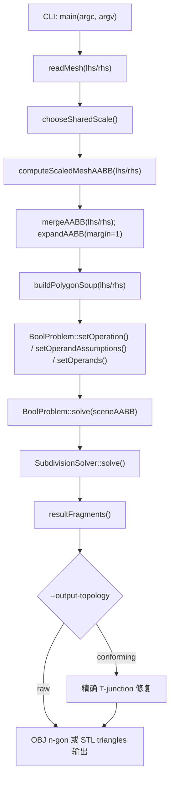

## 2. 应用层到 BoolProblem

`src/application/main.cpp` 的外层顺序比较固定：

1. 解析 `--lhs --rhs --op --out --scale --leaf-threshold --threads --output-topology raw|conforming`。
2. 按扩展名读取左右输入网格（OBJ/STL）；左右输入由应用层并行调度。
3. 选择共享 `scale`，把左右输入放进同一个整数坐标系。
4. 用 `computeScaledMeshAABB()` 对输入网格浮点顶点执行 `floor(coord * scale)` / `ceil(coord * scale)`，得到左右输入 AABB；左右 AABB 与 polygon soup 构建在应用层并行执行。
5. 合并左右输入 AABB，并扩展一圈 margin 作为根场景 AABB。
6. 调用 `buildPolygonSoup()` 把输入面片转换为 `Polygon256` 集合。
7. 构造 `BoolProblem`，设置布尔运算、输入假设、总线程数和左右操作数。
8. 调用 `problem.solve(sceneAABB)`。
9. 把 `problem.resultFragments()` 按输出扩展名写回 OBJ 或 STL。

这里有几个实现细节值得单独记住：

- 应用层并行不是只拆左右输入：`computeScaledMeshAABB()` 按顶点静态分块，`buildPolygonSoup()` 按顶点量化和输入面构造静态分块，导出阶段按结果片段恢复有序顶点；错误检查和最终合并仍按原始顺序串行执行。
- `setOperands()` 会给左操作数写入基础 `WNTV={1,0}`，给右操作数写入 `WNTV={0,1}`。
- CLI 的 `--threads` 会同时设置应用层 `task_arena` 大小和 `BoolProblem::setThreadCount()`；`0` 表示自动并发度，`1` 表示全流程强制串行，`N>1` 表示总参与线程数为 `N`。
- `BoolProblem` 不再暴露直接注入任意 `WNTV` polygon 集合的公开入口，公开输入边界固定为二元操作数。
- 根场景 AABB 来自共享 `scale` 后的输入网格浮点顶点上/下取整，不再由 `SubdivisionSolver` 从 256 位多边形顶点反推。
- STL 输入由 vendored `third_party/stl_reader/stl_reader.h` 负责 ASCII/binary 识别和三角顶点去重；应用层构建 polygon soup 时仍会启用 `triangulateNonCoplanarFaces=true`。
- 最终结果导出到 `.obj` 时保持 polygon soup / n-gon 语义；`raw` 可能包含论文允许的 T 形连接，`conforming` 会在导出前复用已有精确顶点补齐边上的 T 点。应用层仍禁用共面凸合并和 Nef 正则化导出。

### 2.1 CGAL Nef verifier 的语义边界

`src/application/verify.cpp` 复用同一条输入准备路径：`readMesh()`、`chooseSharedScale()`、`computeScaledMeshAABB()` 和启用 `triangulateNonCoplanarFaces=true` 的 `buildPolygonSoup()`。因此 `re-EMBER_verify` 校验的是“量化后的 `Polygon256` 左右输入”上的精确布尔集合，而不是原始浮点 OBJ/STL 在 CAD 语义里的真实实体。

verifier 会用这批量化 polygon soup 同时做两件事：一边运行 `BoolProblem` 并读取 `resultFragments()`；另一边把左右输入精确转成 CGAL Nef oracle 并缓存。候选结果默认以 `--candidate-mode fragments-nef` 直接转 Nef，避免 OBJ double 导出/回读造成二次误差；也可以用 `export-conforming` 测试 T-junction 修复后的精确导出拓扑，或用 `export-nef` 测试 Nef 后处理路径。候选结果转 CGAL mesh 前会在 exact rational 点域中补齐面片之间的 T-junction，把落在某条边上的全局顶点插入该面的边界循环，再三角化成共形 surface mesh。最终判定先尝试把 simple candidate/oracle Nef 转回 exact surface mesh，并比较精确顶点集与面边界环集合；若完全相同，报告中的 `surface_compare_used=1` 表示无需运行最终 Nef overlay 已经证明相等。只有 exact surface 不完全一致时，才退回候选 Nef 与 oracle Nef 的正则化对称差；这只比较实体集合，不要求 face count、片段切分方式或 OBJ 顶点顺序一致。需要复现旧路径时可加 `--disable-surface-compare`。

排查 CGAL Nef 崩溃或长时间卡住时，可以加 `--diagnose-nef --nef-compare-op skip` 先跳过最终 overlay，只输出左右输入、候选 raw soup、候选 conforming soup、candidate Nef surface 和 oracle Nef surface 的 exact 拓扑统计；其中包括边界边、非流形边、同向成对边、重复面、退化面和 T-junction 命中数。诊断还会在 simple Nef 能转回 surface mesh 时做一次不经过 Nef 布尔 overlay 的 exact surface 等价比较。若该比较相等而 `candidate-minus-oracle`、`oracle-minus-candidate` 或 `xor` 卡住/崩溃，问题应归入 CGAL Nef overlay 的鲁棒性边界，而不是 `resultFragments()` 与 oracle 的集合差异。

## 3. BoolProblem 门面流程

`BoolProblem::solve(sceneAABB)` 本身很薄。主流程是五件事：

1. 若当前实例已经执行过一次 `solve()`，直接报错。
2. 非空输入要求调用方提供合法 `sceneAABB`。
3. 校验输入多边形集合合法性，并确认所有输入都符合二元 `lhs/rhs` 标签约定。
4. 根据 `threadCount` 决定自动/串行/固定并发度，并在需要时进入 `oneTBB task_arena`。
5. 构造内部 `SubdivisionSolver`，消费输入 polygon soup，并把聚合结果提取回公开门面。

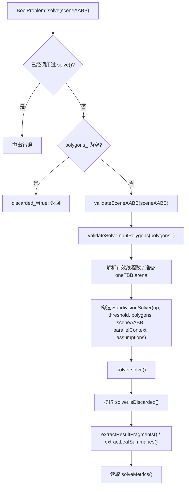

## 4. SubdivisionSolver 总流程

`SubdivisionSolver::solve()` 是当前实现的真正总控入口：

1. 重置内部运行时状态。
2. 使用调用方传入的根节点 AABB。
3. 在根 AABB 最小角点初始化参考点，初始 `WNV` 全零。
4. 进入 `solveRecursive()`。
5. 每个子树在递归返回时就完成 `resultFragments / leafSummaries / solveMetrics` 的向上聚合，并尽早释放子树中间状态。
6. 当前版本只把并行边界放在 child 子树级别；叶内 BSP 和 WNV 分类仍保持单任务内串行。

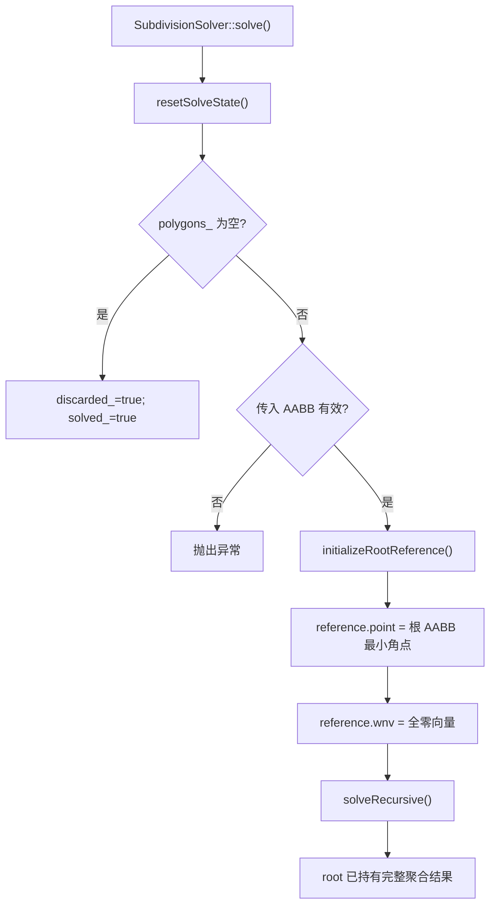

## 5. 递归细分流程

当前 `solveRecursive()` 的决策顺序非常关键，真实实现顺序如下：

1. 尝试 `single operand assumption leaf` 快路径；一旦命中，当前节点直接按普通叶节点完整求解。
2. 若达到叶子阈值，或 AABB 已不可再切分，则转叶子求解；阈值叶片若只因 `PATH_INVALID` 候选耗尽失败且 AABB 还能切，会放弃当前叶子并继续细分。
3. 否则选择切分面并创建左右子节点。
4. 常量 indicator 剪枝只发生在 child 创建前。
5. 若两个 child 都存在，且 sibling 并行门槛满足，则当前线程继续 polygon soup 更大的 child，把较小的 sibling 作为 `oneTBB` task 提交。
6. 两个 child 都完成后，仍按 `left -> right` 固定顺序 move-merge 结果，并立即释放子节点。

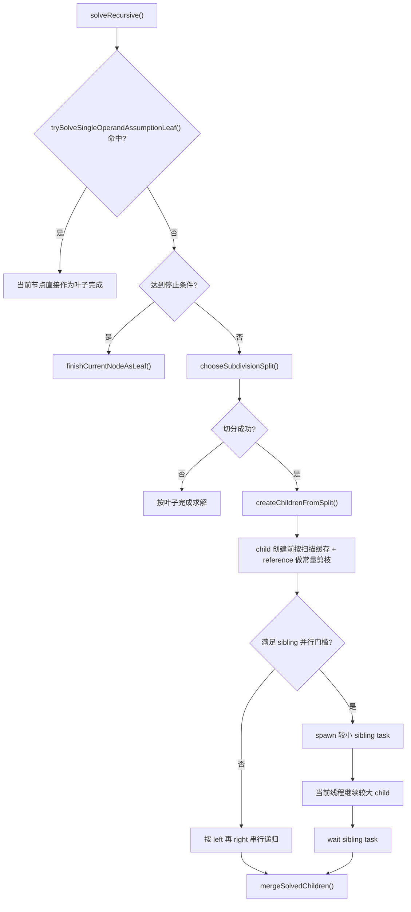

### 5.1 停止条件

`shouldStopSubdivision()` 只有两个条件：

- `polygons_.size() <= leafPolygonThreshold_`
- 当前 `AABB` 已经没有可切分轴

### 5.2 切分策略优先级

当前实现不是单纯 midpoint，而是三段式优先级：

1. `chooseWntvAwareSplit()`
2. `chooseCenterRangeSplit()`
3. `splitAABBAtMidpoint()`

含义分别是：

- `WNTV-aware`：优先找能把某个 `WNTV` 组整体隔到单侧的轴向切分面。
- `center-range`：如果没有 WNTV 分离候选，则按多边形中心分布范围最大的轴切分，并在平均中心位置落刀。
- `midpoint`：最后才退回 AABB 中点切分。

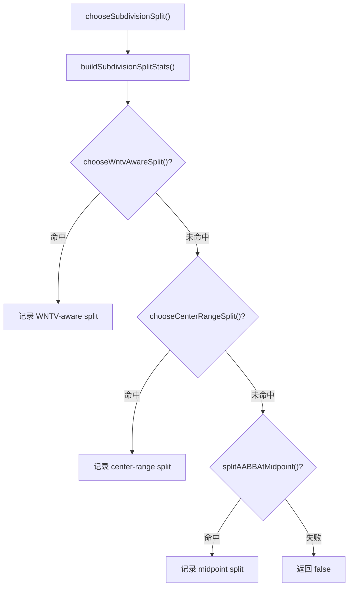

## 6. 子节点创建与参考点传播

切分成功后，`createChildrenFromSplit()` 会做四件事：

1. 用切分平面把当前 `polygons_` 裁成左右两个 child polygon soup。
2. 分别扫描左右 child polygon soup，缓存 `hasLhs/hasRhs/是否单操作数`。
3. 对每个非空 child 独立传播参考点状态 `SubdivisionRefState`。
4. 在真正创建该 child 前，按扫描缓存和 child reference 做常量 indicator 剪枝；只有未被剪掉的 child 才构造 `SubdivisionSolver` 子实例。

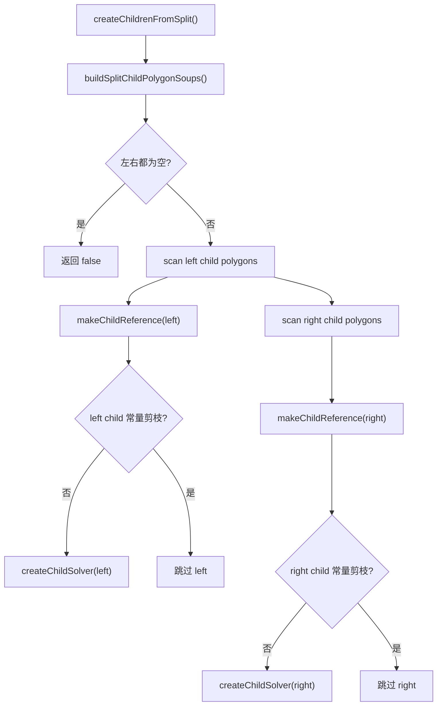

### 6.1 子参考点传播顺序

`makeChildReference()` 的真实顺序是：

1. 先尝试直接复用父参考点。
2. 如果不能复用，再枚举 fast AABB path candidates。
3. fast 阶段没有成功且没有 hard failure，才进入 exhaustive candidates。
4. 用当前统一允许 `SubdivisionClip` 边界横穿的 tracing 入口沿候选路径传播 WNV。
5. 找到成功候选后立即停止。

不能直接复用的条件主要是：

- 父参考点不在子 AABB 严格内部。
- 父参考点落在子多边形表面上。

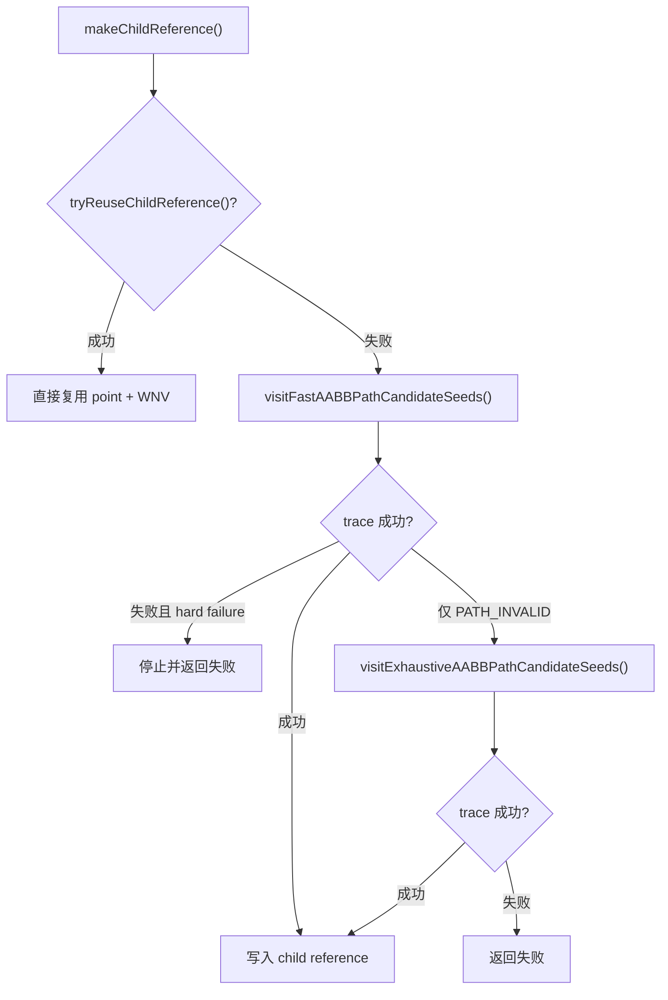

这里还有两个实现细节：

- 当前 `tracePathWNV*` / `tracePathWNVToSurfacePoint*` 都允许穿过由 `SubdivisionClip` 产生、且满足严格对穿条件的边界。
- 一旦 trace 返回的不是 `PATH_INVALID` 而是更硬的失败状态，会记为 `hardFailure`，不再继续穷举。

## 7. 追踪内核流程

上面几节已经说明 trace 是在哪些阶段被调用，但这里更重要的不是逐个 `if` 分支，而是它在算法上到底在做什么。当前实现里关键有两条 trace 路径：

- 子参考点传播使用 `tracePathWNVAllowSubdivisionClipCrossingTrusted()`，目标是把父参考点的体点 `WNV` 传播到 child 内的新体点。
- 叶片分类使用 `tracePathWNVToSurfacePointTrusted()`，目标是把局部参考点传播到待分类片段上的曲面点，并求出该曲面点两侧的 `frontWNV/backWNV`。

### 7.1 体点到体点的 WNV 传播

这一步的核心思想是：把每个 polygon 看成一个携带 `WNTV` 的定向屏障，路径 trace 不是“沿线走一步步更新状态”，而是统计这条路径对所有屏障的有符号穿越，并把这些穿越量累加到参考点已有的 `WNV` 上。

其中最关键的局部量就是 `pcs/pce`：

- `pcs` 是当前 segment 起点相对当前 polygon 的侧别。
- `pce` 是当前 segment 终点相对当前 polygon 的侧别。
- 它们本质上是在判断“这一段是否跨过了当前 polygon 的支撑平面”，不是新的全局状态。

从算法角度看，trace 对每个 polygon 的处理可以概括成 4 步：

1. 先看当前段的两端是否分居 polygon 支撑平面的两侧。
2. 如果没有跨越严格侧别变化，则这段不可能贡献该 polygon 的绕数变化。
3. 如果看起来发生了跨越，再进一步确认命中的到底是 polygon 严格内部，还是边界擦碰、共边、端点贴边这类退化接触。
4. 只有“严格内部穿越”才会把该 polygon 的 `WNTV` 计入 WNV；方向由 `pcs -> pce` 的符号变化决定。

因此 `sigma = (pcs - pce) / 2` 的作用可以直接理解为“这次穿越的方向符号”：

- 从前侧穿到后侧时，累加一次 `+WNTV`
- 从后侧穿到前侧时，累加一次 `-WNTV`

而所有落在 polygon 本身、边界擦碰、沿边重叠这类情况都会被视为路径不可靠，因为它们会让“是否真正完成了一次穿越”变得不再唯一。

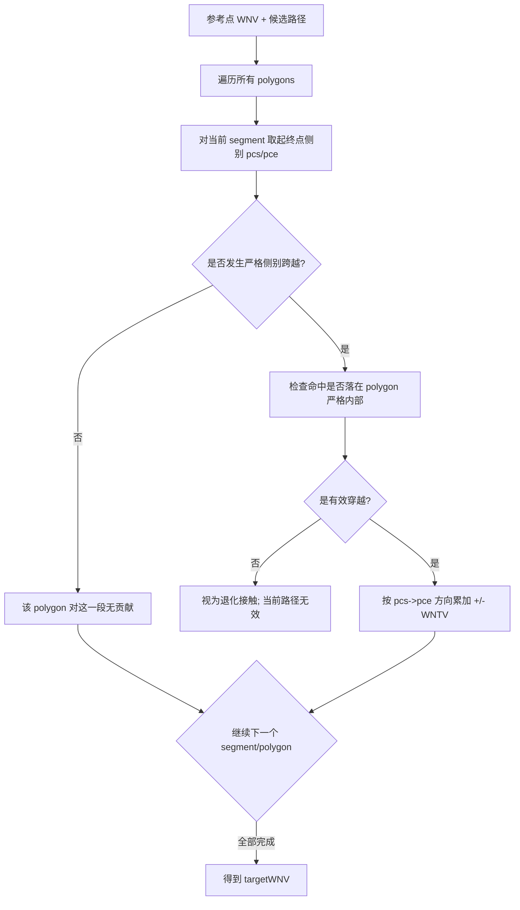

`AllowSubdivisionClipCrossingTrusted` 的特殊性也可以这样理解：它不是“允许更多退化情况”，而只是允许一种非常特定的命中被继续当作有效穿越，即 subdivision 裁剪边界带来的人工边界接触。除此之外，trace 仍然要求路径远离真正的几何歧义。

### 7.2 参考点到目标点的 front/back WNV 追踪

这条路径和上面的参考点传播共享同一个核心思想：仍然是在累计“沿路径穿过了哪些 polygon，各自方向是什么”。差别只在于终点现在不再是体内点，而是落在待分类 fragment 的支撑平面上，所以最后我们要的不是一个单独 `WNV`，而是该曲面点两侧的一对 `frontWNV/backWNV`。

可以把它理解成两段：

1. 先把路径末端之前发生的普通穿越都累加进一个“到达曲面前的 WNV”。
2. 再单独处理“最后落到目标曲面上的那一次穿越”，因为这一次正好决定曲面两侧的 WNV 差值。

这里 `pcs/pce` 的含义没有变，仍然只是当前段两端相对当前 polygon 的侧别。真正新增的是 `surfaceDelta` 这个概念：

- `surfaceWNV` 表示到达目标曲面之前、尚未跨过目标面的那一侧 WNV。
- `surfaceDelta` 表示最后贴着目标曲面发生的那一次跃迁量。

于是最后就不是“求一个终点 WNV”，而是“根据路径是从哪一侧撞上目标曲面，把 `surfaceDelta` 分配给 front 或 back”：

- 如果路径最后从前侧撞到曲面，那么 `frontWNV` 保持 `surfaceWNV`，`backWNV = surfaceWNV + surfaceDelta`
- 如果路径最后从后侧撞到曲面，则反过来分配

这就是叶片分类后续能做布尔判断的原因：布尔边界不是看“曲面上这个点本身的状态”，而是看这张面前后两侧的 inside/outside 是否发生切换。

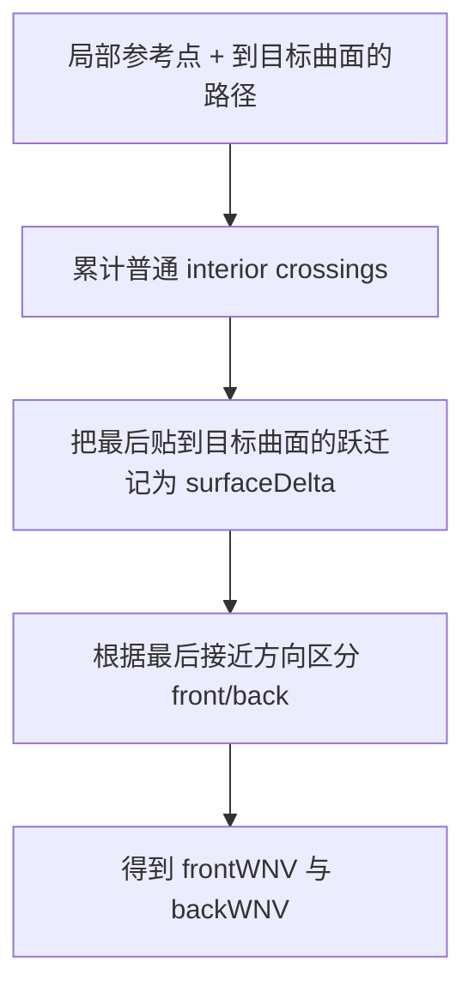

这里要记住的不是某个局部分支，而是整体语义：叶片分类阶段的 trace，本质上是在求“穿过这张 fragment 时布尔指示函数会不会发生跳变”。

## 8. 叶子阶段：局部 BSP 编排

当前叶子节点并不是直接分类原始多边形，而是先得到叶片片段 `leafFragments_`。

默认路径：

1. 对叶子内每个多边形建立局部 `BSPTree`。
2. 收集该叶子的 leaf geometries。
3. 合并为当前叶子的 `leafFragments_`。

单操作数快路径：

- 如果当前叶子只包含单一 `WNTV` 类，且调用方声明了 `noSelfIntersections`，则直接跳过 leaf BSP，`leafFragments_ = polygons_`。

`buildLeafArrangement()` 的实现还有一个小分叉：

- `polygonCount < 8` 时，直接对每个 base polygon 插入其它 polygon。
- `polygonCount >= 8` 时，先缓存 pair relation 邻接表，再驱动 BSP；没有邻接关系的 base polygon 直接作为 leaf fragment 输出。

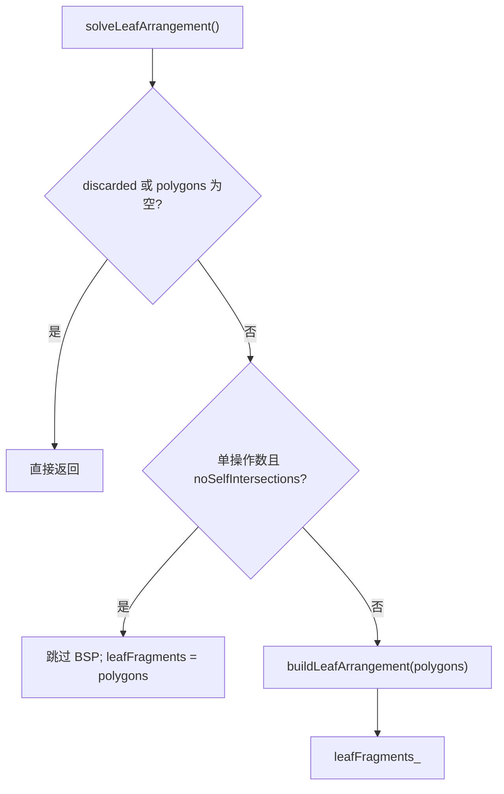

## 9. 叶片分类流程

`classifyLeafFragmentsAndCollectResults()` 会对叶片片段求出其支撑平面两侧的 `frontWNV/backWNV`，再用布尔指示函数决定是否输出。若当前叶子满足 NSI/NNC 单操作数快路径，并且 `leafFragments_` 实际直接别名到原始 `polygons_`，则不会逐片复用分类结果，而是只真实分类一个代表面，再把该结果直接作用到整批多边形。

核心顺序：

1. 以当前节点参考点 `reference_` 作为局部参考点。
2. 先判断是否命中 NSI/NNC 单操作数 bulk fast path；否则再进入普通逐片遍历。
3. 如果命中 NSI/NNC 单操作数 bulk fast path，则只对一个代表面调用 `classifyLeafFragment()`。
4. 代表面分类成功后，直接根据 `(frontStatus, backStatus)` 对整批 `polygons_` 做三选一处理：整体直接输出、整体翻转后输出，或整体丢弃。
5. 如果没有命中 bulk fast path，则回到普通逐片流程：当前片段调用 `classifyLeafFragment()`；在允许单操作数逐片复用时，后续片段可以复用首个片段的 `front/back WNV`。
6. 任一真实分类失败都会先携带最后一次 trace 状态向上报告；只有阈值叶片上的 `PATH_INVALID` 可触发继续细分，其他失败仍直接抛异常，不输出不可信结果。

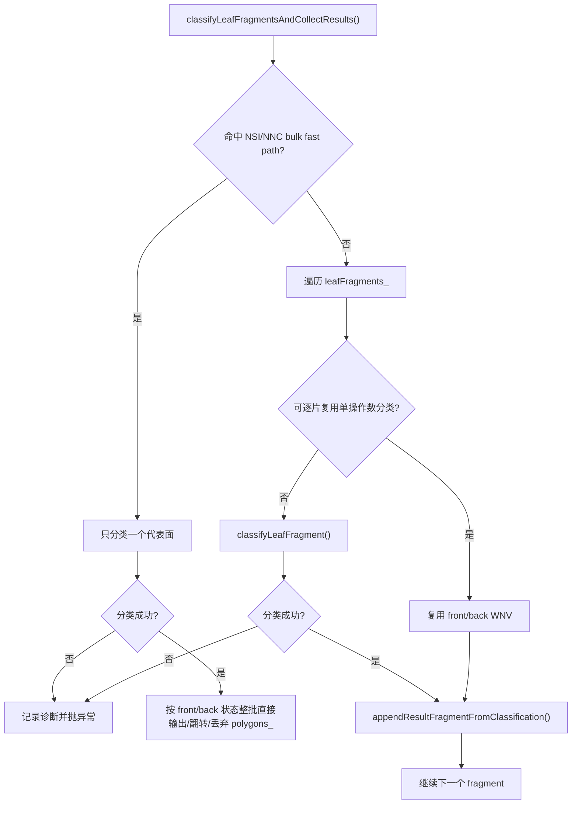

### 9.1 单个叶片片段的候选顺序

`classifyLeafFragment()` 的真实策略是两层嵌套：

当前实现的外层顺序已经直接固定为三段：

1. `centroid heuristic + axis-aligned path`
2. `randomized inset fallback + axis-aligned quick probe + plane-replacement path`
3. `AABB interior bridge rescue`

其中第二段内部还有一个小的目标点扩展策略：

1. 先尝试前 3 个 inset 目标点
2. 仍未成功时，再扩展剩余 inset 目标点

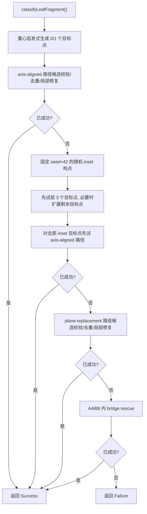

阈值叶片穷尽候选且最后状态为 `PATH_INVALID` 时，如果当前 AABB 仍可切分，`tryFinishStoppedSubdivisionNode()` 会清理本次叶子尝试的临时片段并回到递归切分；该次数记录在 `leafClassificationRetrySubdivisionCount`。AABB 已不可切、切分失败路径、入口单操作数快路径，或者最后状态为 `INPUT_INVALID/FAIL` 时仍按失败处理。候选进入 trace 前会先验证路径非空、从局部参考点连续连接、终点落在待分类片段支撑平面上；不满足这些结构条件时只在当前候选上尝试局部重建，不把 `INPUT_INVALID` 当成普通 `PATH_INVALID` 推动全局穷举。

换平面候选有两层去重：先用起点三平面、目标三平面和替换顺序组成 `PlaneReplacementBuildSignature`，在真正构造路径前过滤重复构造；再用路径端点的齐次点序列作为 trace 级签名，避免同一条路径重复进入 WNV trace。当前签名集合用哈希缓存维护，避免在大量 inset / bridge rescue 目标上反复线性比较。

### 9.2 目标点与路径候选来源

当前实现中的目标点生成来自 `path_candidate_details.h`：

- `centroid heuristic`：用普通浮点重心求整数 `c`，沿最不平行轴的探测线求一个严格内部点。
- `randomized inset fallback`：按论文 4.4 随机选择顶点和正偏移，逐步细化 inset，直到得到严格内部点或耗尽预算。

当前实现中的路径层级来自 `path_candidates.h`：

- `axis-aligned path`：对 centroid heuristic 命中的目标点，以及 inset fallback 生成的全部目标点，按固定 `X -> Y -> Z` 次序构造 1 到 3 段坐标轴路径。
- `plane-replacement path`：对 inset fallback 命中的目标点枚举定义平面与替换顺序，先尝试完全落在 AABB 内的换平面端点序列，再实体化为 1 到 3 段路径；如果中间点越界，则退回原始换平面路径裁剪和 AABB 内桥接。
- `bridge rescue`：当直接路径候选都不可用时，先桥接到 AABB 内部参考点，再对同一批目标点尝试 axis / plane-replacement 路径。
- `direct inset cap`：inset fallback 会对全部目标点先试一次 axis-aligned quick probe；若仍未成功，plane-replacement 阶段先尝试前 3 个目标点，只有仍未分类成功时才扩展剩余目标，避免在常见成功 case 上枚举完整换平面集合。
- 候选诊断字段包括 `leafClassificationCandidateGeneratedCount`、`leafClassificationCandidateUniqueCount`、`leafClassificationCandidateDuplicateSkipCount`、`leafClassificationCandidateRejectedCount`、`leafClassificationCandidateRepairAttemptCount` 和 `leafClassificationCandidateRepairSuccessCount`；trace 状态按 `CentroidAxis`、`InsetReplacement`、`BridgeRescue` 三个阶段分别统计。

## 10. 结果筛选与朝向

分类完成后，并不是所有叶片片段都会进入最终结果。普通路径通过 `appendResultFragmentFromClassification()` 逐片筛选；NSI/NNC 单操作数 bulk fast path 则直接对整批 `polygons_` 做输出、翻转或丢弃，不再逐片追加。

`appendResultFragmentFromClassification()` 的规则是：

- `frontStatus == OUT && backStatus == IN`：直接输出当前片段。
- `frontStatus == IN && backStatus == OUT`：翻转片段朝向后输出。
- 其它组合：不输出。

因此 `resultFragments()` 表示的是布尔边界上的状态过渡面，而不是所有叶级片段。

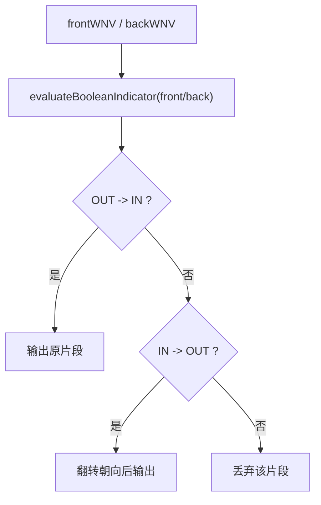

## 11. 诊断出口

当前公开给外部观察求解过程的主要接口不是递归节点对象，而是：

- `BoolProblem::resultFragments()`
- `BoolProblem::leafSummaries()`
- `BoolProblem::solveMetrics()`

其中 `solveMetrics()` 最值得关注的字段通常是：

- 规模类：`effectiveThreadCount`、`nodeCount`、`leafNodeCount`、`maxDepth`、`totalPolygonCount`
- 细分类：`wntvAwareSplitCount`、`centerRangeSplitCount`、`midpointSplitCount`、`leafClassificationRetrySubdivisionCount`
- 并行类：`parallelSiblingSpawnCount`
- 子参考传播类：`childReferenceReuseCount`、`childReferenceTraceCount`、`childReferenceCandidateCount`
- 叶片分类类：`leafFragmentCount`、`classifiedFragmentCount`、`leafClassificationTraceAttemptCount`、`leafClassificationCandidateGeneratedCount`、`leafClassificationCandidateUniqueCount`
- 叶片分类状态类：`leafClassificationCentroidAxis*Count`、`leafClassificationInsetReplacement*Count`、`leafClassificationBridgeRescue*Count`
- 早停/剪枝类：`constantDiscardCount`、`singleOperandAssumptionStopCount`、`singleOperandAssumptionFallbackCount`
  其中 `singleOperandAssumptionFallbackCount` 为兼容保留字段，当前实现应保持为 `0`。
