# 核心逻辑流程图

对应的主要实现文件如下：

- `src/application/main.cpp`
- `src/io/io.cpp`
- `src/core/bool_problem.h`
- `src/core/bool_problem.cpp`
- `src/core/subdivision_solver.h`
- `src/core/subdivision_solver.cpp`
- `src/core/leaf_classifier.cpp`
- `src/algorithm/leaf_arrangement.cpp`
- `src/algorithm/path_candidates.h`
- `src/algorithm/path_candidate_details.h`
- `src/algorithm/WNV_tracing.cpp`

## 1. 总体调用链

当前对外流水线是：

```text
OBJ -> 共享量化 -> Polygon soup -> BoolProblem(顶点预处理/校验) -> SubdivisionSolver -> resultFragments -> OBJ n-gon
```

其中职责边界是：

- `main.cpp` 只负责 CLI、OBJ 读写、共享量化尺度选择、驱动 `BoolProblem`。
- `BoolProblem` 是公开门面，只保存输入、布尔配置和最终结果。
- `SubdivisionSolver` 独占递归树、AABB、参考点传播、叶片片段、分类片段和结果汇总。
- `writePolygonSoupObj()` 默认直接导出 n 边面结果，不主动三角化输出。

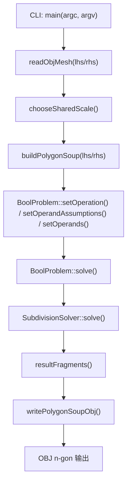

## 2. 应用层到 BoolProblem

`src/application/main.cpp` 的外层顺序比较固定：

1. 解析 `--lhs --rhs --op --out --scale --leaf-threshold`。
2. 读取左右 OBJ。
3. 选择共享 `scale`，把左右输入放进同一个整数坐标系。
4. 调用 `buildPolygonSoup()` 把 OBJ 面片转换为 `Polygon256` 集合。
5. 构造 `BoolProblem`，设置布尔运算、输入假设和左右操作数。
6. 调用 `problem.solve()`。
7. 把 `problem.resultFragments()` 直接写回 OBJ。

这里有两个实现细节值得单独记住：

- `setOperands()` 会给左操作数写入基础 `WNTV={1,0}`，给右操作数写入 `WNTV={0,1}`。
- `BoolProblem` 不再暴露直接注入任意 `WNTV` polygon 集合的公开入口，公开输入边界固定为二元操作数。
- 应用层构建 polygon soup 时启用了 `triangulateNonCoplanarFaces=true`，但最终结果导出仍保持 polygon soup / n-gon 语义。

## 3. BoolProblem 门面流程

`BoolProblem::solve()` 本身很薄，但现在会先做一次输入多边形预处理。主流程是四件事：

1. 重置上一次求解状态。
2. 统一预计算输入 `Polygon256` 的顶点缓存。
3. 校验输入多边形集合合法性，并确认所有输入都符合二元 `lhs/rhs` 标签约定。
4. 构造内部 `SubdivisionSolver`，并把结果复制回公开门面。

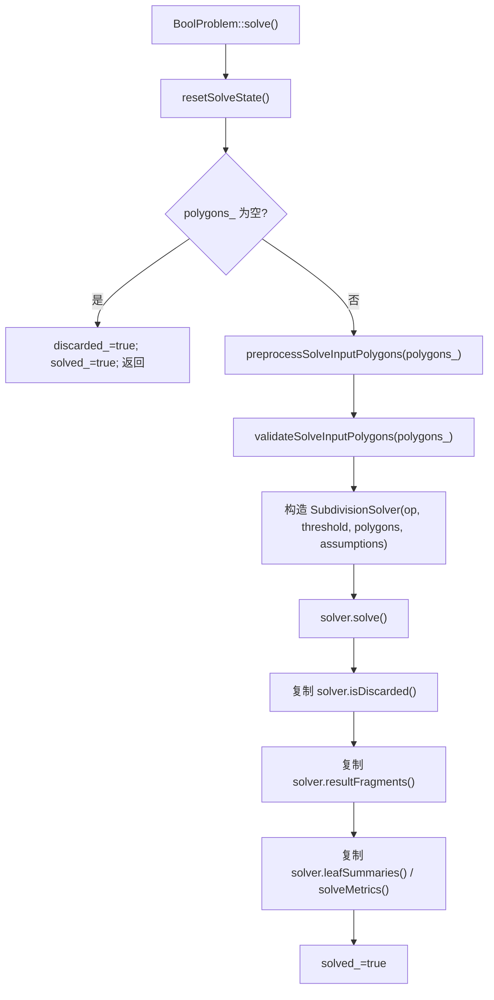

## 4. SubdivisionSolver 总流程

`SubdivisionSolver::solve()` 是当前实现的真正总控入口：

1. 重置内部运行时状态。
2. 计算根节点 AABB。
3. 在根 AABB 最小角点初始化参考点，初始 `WNV` 全零。
4. 进入 `solveRecursive()`。
5. 递归结束后汇总 `leafSummaries()` 和 `solveMetrics()`。

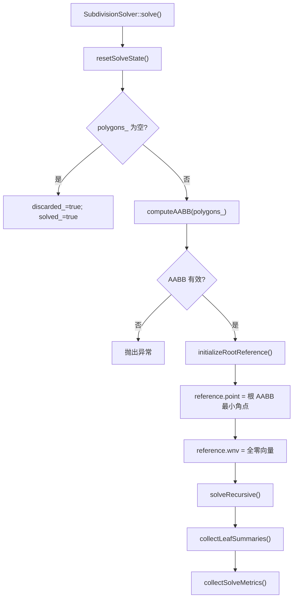

## 5. 递归细分流程

当前 `solveRecursive()` 的决策顺序非常关键，真实实现顺序如下：

1. 空节点 / 非法 AABB 直接丢弃。
2. 若当前子问题的二元布尔指示函数已经恒定，则直接丢弃。
3. 尝试 `single operand assumption leaf` 快路径。
4. 若达到叶子阈值，或 AABB 已不可再切分，则转叶子求解。
5. 否则选择切分面并创建左右子节点。
6. 递归求解左右子节点后合并结果。

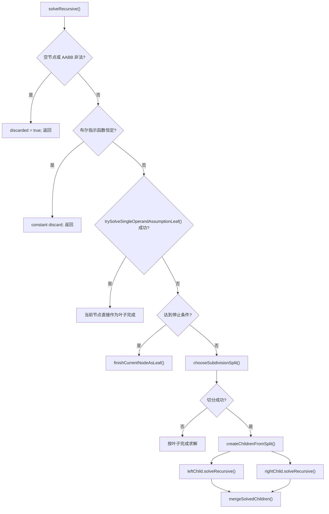

### 5.1 停止条件

`shouldStopSubdivision()` 只有两个条件：

- `polygons_.size() <= leafPolygonThreshold_`
- 当前 `AABB` 已经没有可切分轴

### 5.2 切分策略优先级

当前实现不是单纯 midpoint，而是三段式优先级：

1. `chooseWntvAwareSplit()`
2. `chooseCenterRangeSplit()`
3. `splitAABBAtMidpoint()`

含义分别是：

- `WNTV-aware`：优先找能把某个 `WNTV` 组整体隔到单侧的轴向切分面。
- `center-range`：如果没有 WNTV 分离候选，则按多边形中心分布范围最大的轴切分，并在平均中心位置落刀。
- `midpoint`：最后才退回 AABB 中点切分。

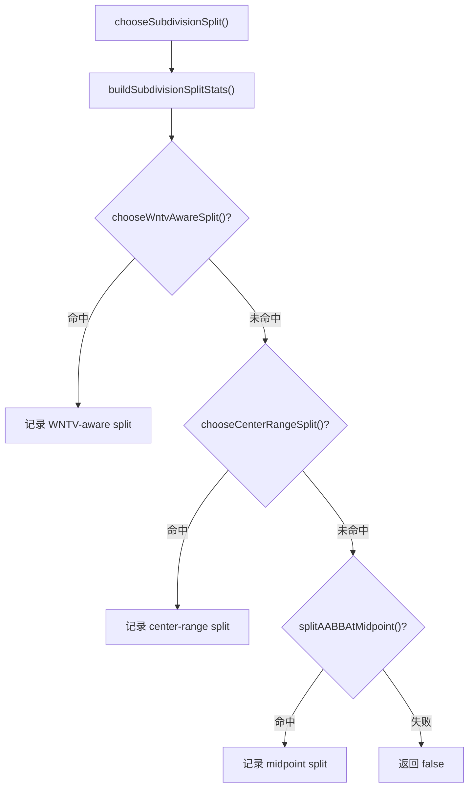

## 6. 子节点创建与参考点传播

切分成功后，`createChildrenFromSplit()` 会做四件事：

1. 用切分平面把当前 `polygons_` 裁成左右两个 child polygon soup。
2. 为左右子问题建立参考点状态 `SubdivisionRefState`。
3. 在真正创建子节点前，再做一次 child-level 常量 indicator 剪枝。
4. 只为仍有意义的子问题构造 `SubdivisionSolver` 子实例。

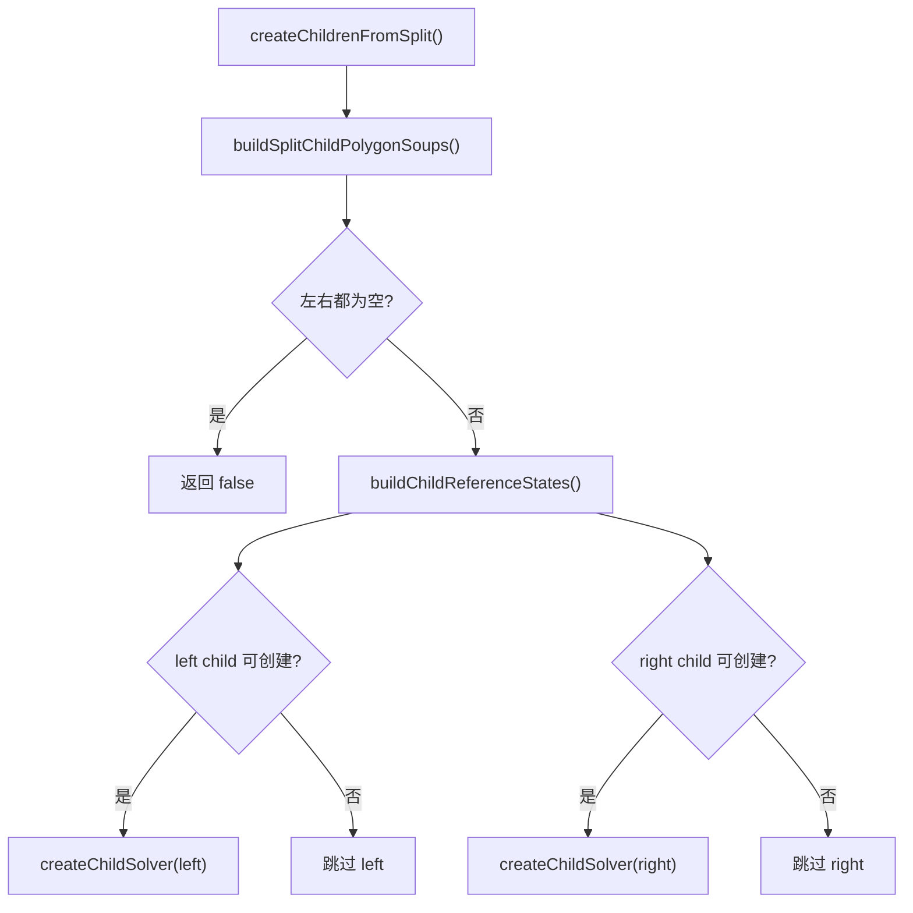

### 6.1 子参考点传播顺序

`makeChildReference()` 的真实顺序是：

1. 先尝试直接复用父参考点。
2. 如果不能复用，再枚举 fast AABB path candidates。
3. fast 阶段没有成功且没有 hard failure，才进入 exhaustive candidates。
4. 用 `tracePathWNVAllowSubdivisionClipCrossingTrusted()` 沿候选路径传播 WNV。
5. 找到成功候选后立即停止。

不能直接复用的条件主要是：

- 父参考点不在子 AABB 严格内部。
- 父参考点落在子多边形表面上。

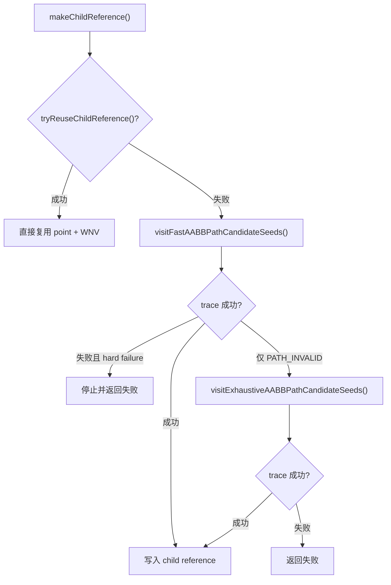

这里还有两个实现细节：

- 子参考点 trace 用的是 `AllowSubdivisionClipCrossingTrusted` 版本，允许穿过 subdivision 裁剪边界。
- 一旦 trace 返回的不是 `PATH_INVALID` 而是更硬的失败状态，会记为 `hardFailure`，不再继续穷举。

## 7. 叶子阶段：局部 BSP 编排

当前叶子节点并不是直接分类原始多边形，而是先得到叶片片段 `leafFragments_`。

默认路径：

1. 对叶子内每个多边形建立局部 `BSPTree`。
2. 收集该叶子的 leaf geometries。
3. 合并为当前叶子的 `leafFragments_`。

单操作数快路径：

- 如果当前叶子只包含单一 `WNTV` 类，且调用方声明了 `noSelfIntersections`，则直接跳过 leaf BSP，`leafFragments_ = polygons_`。

`buildLeafArrangement()` 的实现还有一个小分叉：

- `polygonCount < 8` 时，直接对每个 base polygon 插入其它 polygon。
- `polygonCount >= 8` 时，先缓存 pair relation，再驱动 BSP，以减少重复关系构造。

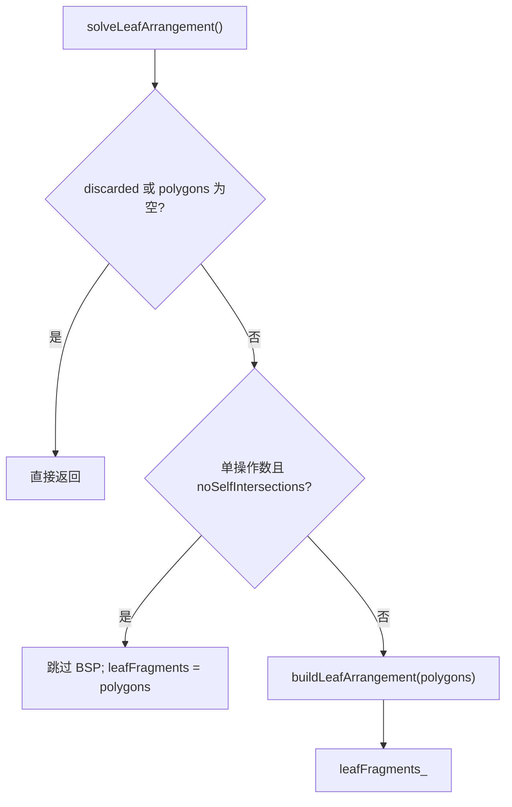

## 8. 叶片分类流程

`classifyLeafFragmentsAndCollectResults()` 会对每个叶片片段求出其支撑平面两侧的 `frontWNV/backWNV`，再用布尔指示函数决定是否输出。

核心顺序：

1. 以当前节点参考点 `reference_` 作为局部参考点。
2. 遍历 `leafFragments_`。
3. 如果单操作数分类结果可复用，则直接复用上一个片段的 `front/back WNV`。
4. 否则调用 `classifyLeafFragment()` 为当前片段尝试路径传播。
5. 分类成功后，根据 `(frontStatus, backStatus)` 决定是否写入 `resultFragments_`。
6. 如果分类失败，当前实现直接抛异常，不输出不可信结果。

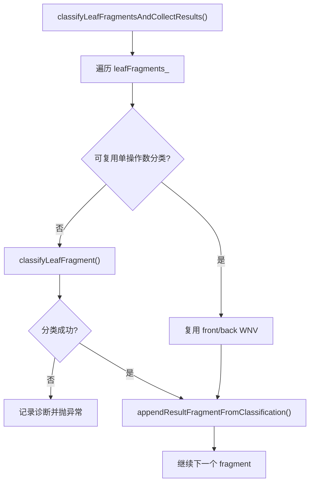

### 8.1 单个叶片片段的候选顺序

`classifyLeafFragment()` 的真实策略是两层嵌套：

第一层先选目标点：

1. `primary` 严格内部点
2. 如果还没成功，再试 `expanded` 严格内部点

第二层在每一批目标点内部按路径层级尝试：

1. `fast`
2. `fallback`
3. `normal-approach`
4. `interior-bridge`

只有前一层全部失败且最后状态仍允许继续时，才进入下一层。

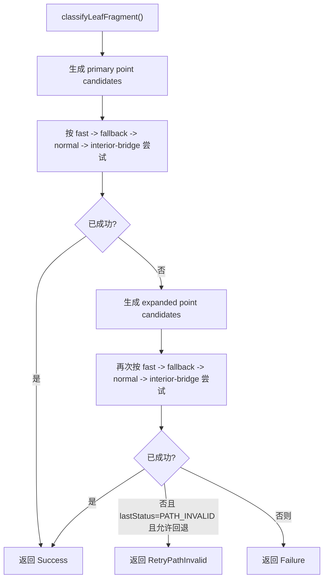

### 8.2 目标点与路径候选来源

当前实现中的目标点生成来自 `path_candidate_details.h`：

- `primary`：优先尝试重心探测命中点，再补一个 `findStrictInteriorPoint()`。
- `expanded`：在 primary 基础上继续加入 inset interior、齐次顶点平均、equalized edge 等兜底内部点。

当前实现中的路径层级来自 `path_candidates.h`：

- `fast`：优先尝试轴对齐 corner path 和 plane replacement path。
- `fallback`：放宽到 target plane 排列和 plane replacement 的更多组合。
- `normal-approach`：把目标片段支撑平面法向作为最后一段接近方式。
- `interior-bridge`：先桥接到 AABB 严格内部点，再继续枚举 fast/fallback 路径。

## 9. 结果筛选与朝向

分类完成后，并不是所有叶片片段都会进入最终结果。

`appendResultFragmentFromClassification()` 的规则是：

- `frontStatus == OUT && backStatus == IN`：直接输出当前片段。
- `frontStatus == IN && backStatus == OUT`：翻转片段朝向后输出。
- 其它组合：不输出。

因此 `resultFragments()` 表示的是布尔边界上的状态过渡面，而不是所有叶级片段。

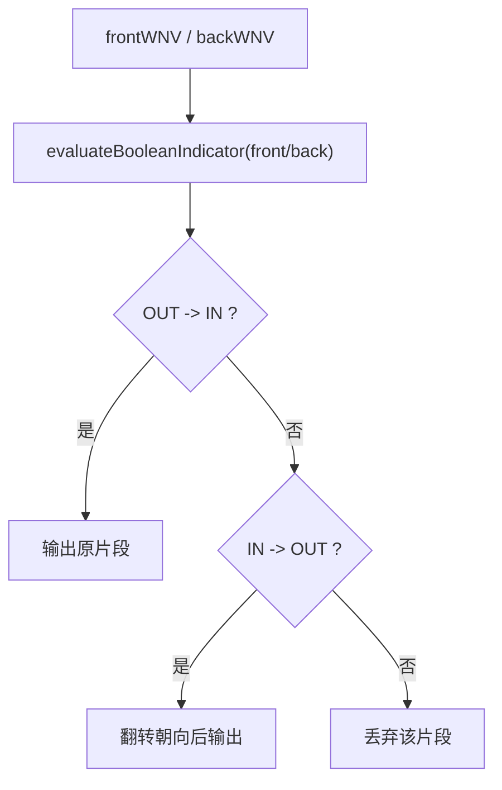

## 10. 诊断出口

当前公开给外部观察求解过程的主要接口不是递归节点对象，而是：

- `BoolProblem::resultFragments()`
- `BoolProblem::leafSummaries()`
- `BoolProblem::solveMetrics()`

其中 `solveMetrics()` 最值得关注的字段通常是：

- 规模类：`nodeCount`、`leafNodeCount`、`maxDepth`、`totalPolygonCount`
- 细分类：`wntvAwareSplitCount`、`centerRangeSplitCount`、`midpointSplitCount`
- 子参考传播类：`childReferenceReuseCount`、`childReferenceTraceCount`、`childReferenceCandidateCount`
- 叶片分类类：`leafFragmentCount`、`classifiedFragmentCount`、`leafClassificationTraceAttemptCount`
- 早停/剪枝类：`constantDiscardCount`、`singleOperandAssumptionStopCount`、`singleOperandAssumptionFallbackCount`
