# EMBER：通过高效鲁棒的局部排列实现精确网格布尔运算

菲利普·特雷特纳，Shaped Code GmbH，德国

尤利乌斯·内林-维尔克塞尔，亚琛工业大学视觉计算研究所，德国

莱夫·科贝尔特，亚琛工业大学视觉计算研究所，德国

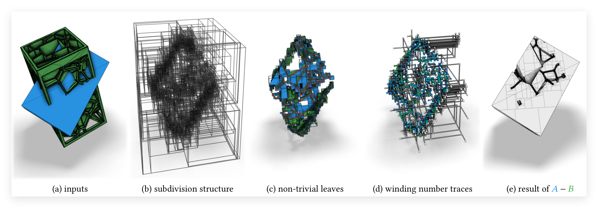

图1. 我们处理网格布尔运算方法的高层概览。我们的方法"EMBER"执行单次自适应递归kd树型空间细分，同时利用多种提前终止剪枝准则。在叶节点中，所有面片通过局部BSP树进行两两相交，分割成不相交的多边形。这些多边形通过线段追踪根据其绕数进行分类。我们实现最大效率的关键贡献在于：由于我们在递归细分过程中传播已知绕数的参考点，这些绕数可以在每个叶节点局部计算。所有计算均采用基于平面的网格表示和固定宽度齐次整数坐标，从而保证精确性。此示例包含120万个输入三角形，我们的多线程实现在8核消费级CPU上仅需34毫秒。作为对比，QuickCSG（非精确，[Douze等人2017]）耗时1010毫秒，Mesh Arrangements（精确，[Zhou等人2016]）耗时141秒。

布尔运算符是几何处理与CAD/CAM领域中广泛任务的基本工具。我们提出一种新颖方法EMBER，用于计算多边形网格的布尔运算，该方法同时具备精确性、可靠性和高性能。通过为输入网格采用基于平面的几何表示并结合近期提出的齐次整数坐标，保证了运算的精确性。算法的可靠性源于基于广义绕数和网格排列的算法表述。通过避免构建全局加速结构，实现了高性能。我们的算法对场景包围盒执行自适应递归细分，同时动态生成并跟踪所有必需数据。通过利用多种提前终止准则，可以避免生成和检查对输出无贡献的区域。通过精心实现和工作窃取多线程架构，我们能够以交互速率计算数百万三角形网格间的布尔运算。我们在Thingi10K数据集上进行广泛评估，证明我们的方法在性能上超越现有先进算法（包括QuickCSG等非精确方法）数个数量级。

作者联系方式：菲利普·特雷特纳，trettner@shapedcode.com，Shaped Code GmbH，德国；尤利乌斯·内林-维尔克塞尔，nehring-wirxel@cs.rwth-aachen.de，亚琛工业大学视觉计算研究所，德国；莱夫·科贝尔特，kobbelt@cs.rwth-aachen.de，亚琛工业大学视觉计算研究所，德国。

本作品允许为个人或课堂使用制作数字或硬拷贝的全部或部分内容，前提是复制品不用于盈利或商业利益，且每份复制品首页需标注本声明及完整引用信息。必须尊重非作者所有的作品组成部分的版权。允许注明出处的摘要引用。其他形式的复制、再版、在服务器上发布或重新分发列表，需要事先获得特定许可和/或支付费用。请向permissions@acm.org申请许可。

$^ ©$ 2022 版权归所有者/作者所有。出版权经许可授予ACM。

0730-0301/2022/7-ART39 $15.00

https://doi.org/10.1145/3528223.3530181

CCS概念：· 计算方法 网格几何模型；网格模型。

附加关键词：网格布尔运算、实体建模、CSG、基于平面的几何、BSP、整数运算、绕数向量

# ACM参考文献格式：

Philip Trettner, Julius Nehring-Wirxel, and Leif Kobbelt. 2022. EMBER: Exact Mesh Booleans via Efficient & Robust Local Arrangements. ACM Trans. Graph. 41, 4, Article 39 (2022年7月)，共15页。https://doi.org/10.1145/3528223.3530181

# 1 引言

在实体建模中，计算物体的并集、交集或差集是自然的基本操作。这些被称为布尔运算符，是所有类型的几何处理和CAD/CAM任务所必需的。作为建模技术，它们构成了构造实体几何（CSG）的基础。无数应用以不同形式依赖于实体布尔运算。铣削模拟从初始工件中减去刀具网格，而碰撞测试则隐式检查物体交集是否非空。在模拟和游戏中，可破坏环境通常依赖于CSG概念。几乎所有3D建模和CAD工具都包含使用布尔运算符构建或修改对象的功能。

在本文中，我们专注于几何表示中最流行的形式：三角形和多边形网格。即使网格处理算法不直接使用布尔运算，它们通常也有严格的输入要求，例如网格必须是2-流形且水密的。许多流程需要复杂的预处理和后处理来满足或恢复这些要求。这类网格修复算法与布尔运算符有很强的相似性。实际上，修复自相交的一种方法是应用自并集运算。

网格布尔运算受到广泛关注并具有丰富历史。实现既鲁棒又高效的解决方案已被证明异常困难。计算交点是几乎所有网格布尔运算方法的组成部分，在使用浮点运算时具有数值挑战性。小而薄的三角形、共面或近似共面的面片、过于接近边或顶点的射线都构成重大挑战。这些情况下的舍入误差容易导致错误分类、拓扑不一致，最终产生错误结果。就豪斯多夫距离而言，这些误差通常是无界的。

这些问题在自动化或无人监督的环境中可能产生不成比例的影响。这主要是由于执行操作的数量庞大以及从这类错误中恢复的困难或完全不可能。其次，自动生成的CSG操作往往呈现规律性模式，如规则间隔的平移，这会不断增加出现退化配置的风险。如果输出再次作为输入使用（迭代CSG设置），这些问题会呈指数级放大。为保持强保证，需要数值精确的网格布尔运算。具体方法各有不同，但几乎所有方法都使用精确数值基础，如任意精度数字或精确浮点谓词。代价通常是运行时性能下降数个数量级。

实际应用通常要求精确性和鲁棒性以保证可靠性。但同时，高性能也是必需条件，这构成了相互冲突的目标。例如，考虑需要计算数十万次布尔差集的CNC铣削过程模拟。若没有达到（或超过）实时性能，这种模拟（用于碰撞预测）将显著拖慢设计和制造流程。即使最先进的非精确方法也未能达到这种性能，而我们的方法不仅实现这一目标，还保证结果的精确性。

# 1.1 贡献

我们提出EMBER方法，这是一种为满足精确性、鲁棒性和高效性这些严格要求而设计的精确网格布尔运算方法。从宏观视角看，该流程概念上很简单（见图1）。我们通过沿轴对齐平面分割，对给定多边形集进行递归细分。当多边形数量足够少时，我们计算两两相交线段并将其整合到局部、每多边形的BSP中。通过沿线段链追踪到局部参考位置，根据绕数对结果多边形集进行分类。

分类本身基于广义绕数向量[Jacobson等人2013]，我们对其进行了扩展以支持局部线段追踪。这使得我们能够在细分过程中跟踪具有已知绕数的局部参考位置。因此，所有细分叶节点都可以局部计算，无需全局加速结构，这极大地提升了性能。它还允许我们推理特定细分过程中可能出现的绕数向量，从而实现高效的提前终止准则。

数学基础依赖于基于平面的几何和近期提出的齐次整数坐标[Nehring-Wirxel等人2021]。这一范式最初为3D BSP开发，可以在现代CPU上极其高效地实现。我们扩展了其表述以处理多边形、线段及其相交。

总之，我们的多边形网格布尔运算方法具有精确性、鲁棒性和极高的性能。具体而言，我们的贡献包括：

(1) 完全保持局部性且无需预计算的基于细分的网格布尔运算方法。

(2) 基于通过线段追踪计算的绕数向量的多边形分类。

(3) 通过多边形局部BSP解析两两相交。

(4) 使用整数齐次坐标实现多边形网格和线段追踪的快速精确平面几何表述。

我们通过进一步利用提前终止机会和优化的多线程实现，实现了最大性能。在Thingi10K数据集上的评估表明，我们的方法在性能上超越当前先进方法数个数量级。为促进我们的方法在进一步研究和应用中的使用，可在项目页面graphics.rwth-aachen.de/ember-exact-mesh-booleans获取实现。

# 2 相关工作

网格布尔运算通常分为基于顶点或基于平面的方法，可分为精确与非精确两类。精确方法常采用任意精度算术（如GMP [Granlund and the GMP development team 2020]）或浮点谓词（如[Attene 2020; Shewchuk 1997]）。近期[Nehring-Wirxel et al. 2021]提出了基于固定宽度整数齐次坐标的替代方案，支持高性能精确谓词与几何构造。非精确方法依赖经典浮点运算，通常存在稳定性问题，对拓扑和几何正确性的保证较弱，但计算速度通常显著更快。

## 2.1 基于顶点的方法

基于顶点方法的通用流程是：先计算输入网格的所有相交部分，再确定结果多边形中哪些应纳入输出[Barki et al. 2015; Cherchi et al. 2020; Douze et al. 2017; Zhou et al. 2016]。

部分方法为提升性能而牺牲算法稳定性：最值得注意的是QuickCSG[Douze et al. 2017]结合环绕数向量与动态构建的隐式加速结构，配合智能剪枝策略实现高速布尔运算。但该方法无法保证处理共面配置时的输出正确性。虽然可通过顶点扰动减少失效案例，但无法完全消除。

为规避浮点数数值舍入导致的算法稳定性问题，[Zhou et al. 2016]采用任意精度算术计算所有三角形-三角形相交，但牺牲了性能。通过判定三角形对应体单元的环绕数来确定其是否纳入输出。[Cherchi et al. 2020]改用浮点谓词[Attene 2020; Shewchuk 1997]替代精确算术，实现了更快的网格排列计算。类似地，[de Magalhães et al. 2020]使用精确算术达到与[Douze et al. 2017]相当的性能，但无法处理自相交情况。

## 2.2 基于平面的方法

除纯顶点方法外，基于平面的布尔方法也有悠久历史。[Naylor et al. 1990]首次将二叉空间剖分（BSP）引入网格布尔运算领域，通过隐式BSP树表示输入实体，再通过合并函数将两个输入实体融合为表示输出实体的单一BSP。但该方法采用的网格切割子程序因浮点舍入不一致存在稳定性问题。为解决此问题，[Bernstein and Fussell 2009]在基于BSP的布尔运算中引入过滤浮点谓词[Shewchuk 1997]。为避免中间结果需要无限提高顶点位置精度，他们还提出了纯基于平面的多边形定义方案——新顶点仅由三个输入平面的交点定义。遗憾的是，其方案在处理大规模输入时扩展性较差，这继承自[Naylor et al. 1990]提出的原始BSP合并算法。[Campen and Kobbelt 2010]通过采用全局八叉树避免扩展性问题：将八叉树细分直至每个叶节点仅含少量三角形，再在包含双方输入三角形的叶节点中局部使用[Bernstein and Fussell 2009]的BSP方法。近期[Nehring-Wirxel et al. 2021]提出基于BSP的方法，用固定宽度整数谓词替代浮点运算。他们采用精确网格切割提取凸BSP单元，将三个输入BSP平面交点处的三维顶点坐标存储为整数系数的四维齐次坐标。

虽非基于BSP，[Hachenberger et al. 2007]通过结合精确算术与基于平面的Nef多面体[Nef 1978]实现网格布尔运算。该方法虽可靠性高，但存在性能和内存消耗问题。

我们的方法融合了多种现有技术：采用[Nehring-Wirxel et al. 2021]的整数齐次坐标并将其扩展至支持线段-多边形相交计算；基于广义环绕数[Jacobson et al. 2013; Zhou et al. 2016]进行分类，但改为通过线段追踪而非扩展体单元进行计算；整体细分策略与[Douze et al. 2017]相似，均避免构建全局加速结构。

# 3 数学基础

我们的方法采用了[Nehring-Wirxel等人2021]的固定位宽整数构建方案。他们的方法建立在[Bernstein和Fussell 2009]的平面化方法与谓词体系之上，但核心算术运算采用整数系数而非浮点谓词。若输入值有界，则所有中间结果同样有界，这为使用固定位宽整数实现高效计算提供了可能。在他们的体系下，平面交点可通过齐次坐标中的4D整数位置进行精确构建。

具体而言，我们接受的输入多边形需满足：每个3D坐标使用26位整数，或是由本方法先前生成的输出。三角形和多边形通过一个支撑平面与若干边平面（每条边对应一个平面）表示。平面以整数系数$(a,b,c,d)$存储，代表满足以下方程的所有点：
$$
ax + by + cz + d = 0。\tag{1}
$$
（未归一化的）平面法向量$n$为$(a,b,c)$。整数位宽的设置确保可为任何输入网格构建基于平面的三角形，且所有后续中间结果不超过256位。当每个操作的输入输出精度已知时，可采用高度高效的加法与乘法代码。基于此，可实现实用的谓词与构建操作。例如，两个平面$p$与$q$平行的条件是：
$$
n_p \times n_q = \vec{0}。\tag{2}
$$
[Nehring-Wirxel等人2021]最重要的洞见或许是：三个平面$p,q,r$的交点$x = \operatorname{intersect}(p,q,r)$若以齐次坐标表示，则存在精确构建公式：
$$
x = \left(\left| \begin{array}{lll} d_p & b_p & c_p \\ d_q & b_q & c_q \\ d_r & b_r & c_r \end{array} \right|, \left| \begin{array}{lll} a_p & d_p & c_p \\ a_q & d_q & c_q \\ a_r & d_r & c_r \end{array} \right|, \left| \begin{array}{lll} a_p & b_p & d_p \\ a_q & b_q & d_q \\ a_r & b_r & d_r \end{array} \right|, \left| \begin{array}{lll} a_p & b_p & c_p \\ a_q & b_q & c_q \\ a_r & b_r & c_r \end{array} \right|\right)^T \tag{3}
$$
若最后一个坐标$x_4$为零，则交点不唯一。给定额外平面$s$，可通过下式对$x$（相对于$s$）进行分类：
$$
\begin{array}{l}
\operatorname{classify}(x, s) = \operatorname{sign} \langle x, s \rangle \cdot \operatorname{sign} x_4 \\
= \left\{
\begin{array}{ll}
1, & \text{if } x \text{ is on the positive side of } s \\
-1, & \text{if } x \text{ is on the negative side of } s \\
0, & \text{if } s \text{ contains } x
\end{array}
\right. \tag{4} \\
\end{array}
$$
对于3D整数位置$\boldsymbol{p}$（如输入顶点或八叉树角点），上式可简化为$\langle n_s,p \rangle + d_s$。利用这些操作（特别是求交与分类），可实现高效的多边形裁剪（参见第4.2.1节）。

## 3.1 扩展操作

为直接处理多边形，我们在[Nehring-Wirxel等人2021]的基础上构建了额外操作。基于平面的范式提供了一组简洁优雅的构建方式（见图2）。基本实体是平面。两个非平行平面$p,q$定义一条直线。几何上，该直线是$p$与$q$的交线。但形成直线无需任何计算，我们直接将有序对$(p,q)$视为直线。类似地，三个平面通常交于一点。其他几何图元也可轻松定义：射线由三个平面$(l_0,l_1,r)$表示，其中$(l_0,l_1)$构成射线所在的直线，而$r$“截去”不属于射线的另一半直线。因此，线段由四个平面$(l_0,l_1,r_0,r_1)$表示，其中$(l_0,l_1)$是“支撑直线”，$r_0$与$r_1$在该直线上界定线段范围。凸多边形包含一个支撑平面$s$和一组边平面$e_1,\ldots,e_n$。点$x$属于多边形当且仅当$\operatorname{classify}(s,x)=0$且对所有边平面满足$\operatorname{classify}(e_i,x)\le 0$。若所有不等式严格成立，则$x$为内点。包围盒可视为六个特定平面界定的空间，但存储时通常采用更简洁的表示形式。

直线、射线和线段与多边形的求交异常简单。若存在交点$x$，则其由支撑直线与多边形支撑平面的交点$\operatorname{intersect}(l_0,l_1,s)$给出。若对任意边平面有$\operatorname{classify}(e_i,x)>0$，则$x$位于多边形外。若$x$对$r$（射线情形）或$r_0$、$r_1$（线段情形）的分类为正，则交点同样无效。边界情况也易于检测处理：若$(l_0,l_1)$与$s$平行，则$x$不存在；但若$(l_0,l_1)$位于$s$内，则可能存在相交线段。该线段可通过将查询直线、射线或线段对所有边平面$e_i$进行裁剪得到。
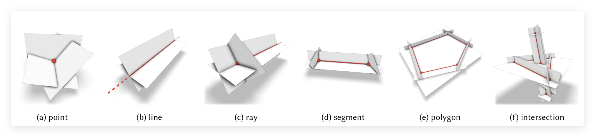
**图2.** 在基于平面的几何中，可将各类几何图元定义为具有不同解释的平面元组。点是三个平面的交点，直线需要两个平面。射线是带有起始平面的直线。线段是带两个边界平面的直线。凸多边形位于支撑平面上，并由一系列边平面界定。各类几何图元的求交可通过平面构建与分类表述。例如，线段-多边形交点是线段所在直线与多边形支撑平面形成的点，当该点位于线段边界平面与多边形边平面内侧时为有效交点。

## 3.2 问题性操作

固定精度平面与齐次坐标在某些常见操作下不封闭。最显著的是，尽管我们选择的精度界限确保任何具有整数坐标的多边形均可转换为其基于平面的表示，但对于齐次坐标表示的多边形，这一性质通常不成立。

更根本地，给定齐次整数坐标下的两点$x$与$x^{\prime}$，其差值必须计算为：

$$
\left( \begin{array}{c} x_{1} \\ x_{2} \\ x_{3} \\ x_{4} \end{array} \right) - \left( \begin{array}{c} x_{1}^{\prime} \\ x_{2}^{\prime} \\ x_{3}^{\prime} \\ x_{4}^{\prime} \end{array} \right) = \left( \begin{array}{c} x_{1} \cdot x_{4}^{\prime} - x_{1}^{\prime} \cdot x_{4} \\ x_{2} \cdot x_{4}^{\prime} - x_{2}^{\prime} \cdot x_{4} \\ x_{3} \cdot x_{4}^{\prime} - x_{3}^{\prime} \cdot x_{4} \\ x_{4} \cdot x_{4}^{\prime} \end{array} \right)
$$

其中$\operatorname*{gcd}(x_4,x_4^\prime)=1$。因此，即使$x$与$x^{\prime}$在精度界限内，$x-x^{\prime}$也可能超出。$x_4 \cdot x_4^{\prime}$所需的位宽是$x_4$与$x_4^{\prime}$单独位宽的两倍，这与固定位宽整数约束相悖。直接后果是：虽然可通过三个平面的交点构建分数位置的点，但对其进行常规向量运算的能力严重受限。即使是看似无害的两点中点，通常也无法在固定精度限制下计算。

这进一步意味着无法仅从这类位置定义新多边形。支撑平面与边平面必须通过其他方式获取。特别地，多边形三角剖分通常不可行。

类似地，我们无法直接定义两点间的线段。这在第4.4节成为次要障碍，因为分类操作需要从参考位置到面内点的线段追踪。虽然直接线段不可得，但我们证明任意两点间总可通过至多三条线段构造路径。具体而言，我们利用定义每个点的平面子集构建两个中间可表示点。

## 3.3 精度

使用3D或4D整数坐标时，所有所述操作均是精确的。不准确性仅出现在系统接口处，即导入或导出网格时。导入过程中，我们将输入坐标缩放并舍入以充分利用26位整数范围。对于$1\mathrm{m}^3$场景，这对应约$15\mathrm{nm}$精度（或等效于近8位十进制数字）。网格格式通常要求浮点数，导出时需进行舍入步骤，该步骤可使用单精度或双精度浮点完成。

## 3.4 环绕数与布尔运算

与网格排布方法[Zhou et al. 2016]相同，我们要求所有输入网格都能生成如[Jacobson et al. 2013]所定义的分段常数整数广义环绕数（PWN）场。PWN网格是限制最少但仍能产生明确定义布尔运算的网格类别之一。值得注意的是，许多自相交、非流形或退化配置都能得到支持，并仍能产生明确结果。

环绕数向量（WNV）$\mathbf { w } = ( w _ { 1 } , \ldots , w _ { n } ) \in \mathbb { Z } ^ { n }$ 是为空间中不位于任何输入表面的每个点定义的$n$元组。传统上，$n$表示输入网格数量，每个$w _ { i }$统计网格$i$被"进入"的次数。根据法线方向，$w _ { i }$可为负值。$w _ { i } = 0$对应"外部"状态。
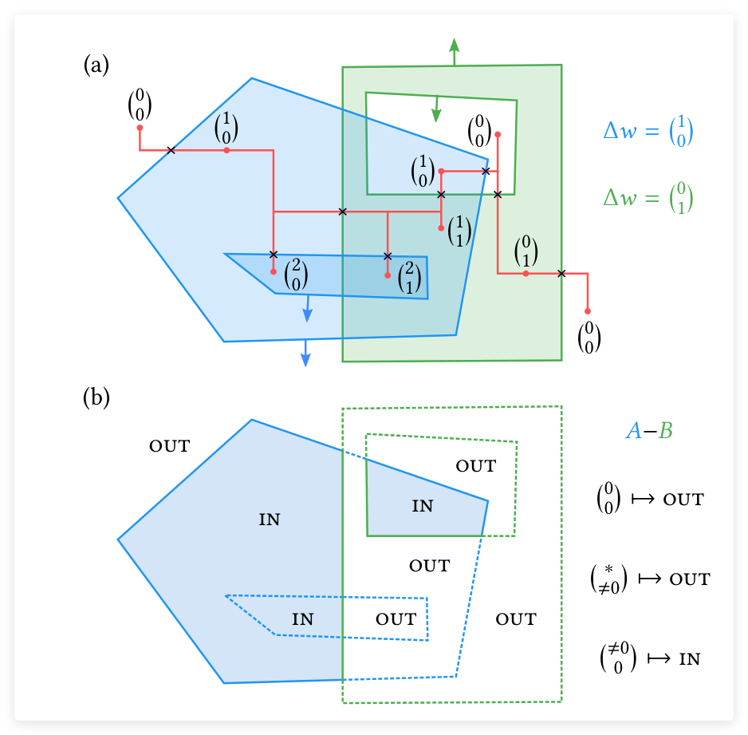
图3.（a）环绕数向量（WNV）为非表面点定义，统计每个网格被进入或离开的次数。它们能优雅处理孔洞和嵌套组件。WNV可通过从已知WNV点出发追踪路径计算。每当路径与网格相交时，根据法线方向对WNV进行增减。

（b）布尔运算可通过将环绕数映射为"内/外"状态实现，即通过对WNV提供指示函数。结果包含所有发生"外-内"或"内-外"转换的表面。

$w _ { i } \neq 0$对应"位于网格$i$内部"。根据场景不同，其他解释可能更为实用。

针对本方法，我们引入环绕数转换向量（WNTV）$\Delta \mathbf { w }$的概念。输入表面（非表面交线处）上的任意点，根据法线方向具有唯一的前方WNV $\mathbf { w } _ { \mathrm { F } }$和后方WNV ${ \bf w _ { B } }$。现定义$\Delta \mathbf { w } = \mathbf { w _ { B } } - \mathbf { w _ { F } }$，即从前向后穿过该表面时WNV的增量（参见图3(a)）。

与[Zhou et al. 2016]相同，我们将布尔运算定义为WNV上的指示函数。例如：

$$
f_{\text{union}}(\mathbf{w}) = \left\{ \begin{array}{ll} \mathrm{IN}, & \text{若任意} w_i \neq 0 \\ \mathrm{OUT}, & \text{否则} \end{array} \right. \tag{5}
$$

对应$n$个网格的并集。指示函数在$\mathbf { w } _ { \mathrm { F } }$和$\mathbf { w } _ { \mathrm { B } }$处求值。指示函数发生变化的点属于输出表面。在实际方法中，我们将所有输入多边形切割为具有明确定义$\mathbf { w } _ { \mathrm { F } }$和${ \bf w _ { B } }$的小多边形。发生（外，内）转换的多边形按原样输出，而（内，外）转换的多边形通过反转顶点顺序输出以保持正确法线方向。（外，外）完全位于结果外部，（内，内）完全位于内部（参见图3(b)），两者均可跳过。

WNV表示全局信息：给定位置位于每个输入网格内部的次数。相反，WNTV是局部"导数"信息：穿过特定表面时WNV如何变化？WNV便于求值布尔运算，而WNTV为从输入计算$\mathbf { w } _ { \mathrm { F } }$和${ \bf w _ { B } }$提供了自然方式。

每个输入多边形$t$具有关联的WNTV $\Delta \mathbf { w } ^ { \mathbf { t } } \in \mathbb { Z } ^ { n }$。通常选择$\Delta \mathbf { w } ^ { \mathbf { t } } = ( 0 , \ldots , 0 , 1 , 0 , \ldots , 0 ) ^ { T }$，其中若$t$属于第$j$个输入网格，则1位于第$j$个分量。直观上，每次从外向内穿过网格$j$的表面时，WNV的第$j$个分量递增；从内向外穿过时递减。形式化表述：给定非表面点$x$和$y$，以及$x$处的起始WNV $\mathbf { w } ^ { \mathbf { x } }$，收集所有与线段$( x , y )$相交的多边形$T$并计算：

$$
\mathbf{w}^{\mathbf{y}} = \mathbf{w}^{\mathbf{x}} + \sum_{t \in T} \operatorname{sign} \left\langle n_t, x - y \right\rangle \cdot \Delta \mathbf{w}^{\mathbf{t}},
$$

其中$n _ { t }$为$t$的外向法线，$\Delta \mathbf { w } ^ { \mathbf { t } }$为$t$关联的WNTV。此公式仅当$x$和$y$不在任何表面上，且$T$中所有多边形与$( x , y )$在内部有唯一交点时有效。若$y$位于法线为$n _ { \mathrm { r e f } }$的表面上，只要$y$不在任何边上，可通过微调计算$\Delta \mathbf { w } ^ { \mathbf { y } }$、${ \bf w } _ { \mathrm { F } } ^ { \mathrm { y } }$和$\mathbf { w _ { B } ^ { y } }$：

• 计算$T ^ { \prime } = \{ t \in T \mid y \in t \}$（包含$y$的多边形）
• 使用$T \setminus T ^ { \prime }$计算$\mathbf { w } ^ { \mathbf { y } }$
• 计算$\Delta \mathbf{w}^{\mathbf{y}} = \sum_{t \in T^\prime} \operatorname{sign} \langle n_t, x - y \rangle \cdot \Delta \mathbf{w}^{\mathbf{t}}$
• 根据$\langle n _ { \mathrm { r e f } } , x - y \rangle$的符号构建WNTV：

$$
\begin{array}{l}
1 \mapsto \mathbf{w}_{\mathbf{F}}^{\mathbf{y}} = \mathbf{w}^{\mathbf{y}} \text{ 且 } \mathbf{w}_{\mathbf{B}}^{\mathbf{y}} = \mathbf{w}^{\mathbf{y}} + \Delta \mathbf{w}^{\mathbf{y}} \\
-1 \mapsto \mathbf{w}_{\mathbf{F}}^{\mathbf{y}} = \mathbf{w}^{\mathbf{y}} + \Delta \mathbf{w}^{\mathbf{y}} \text{ 且 } \mathbf{w}_{\mathbf{B}}^{\mathbf{y}} = \mathbf{w}^{\mathbf{y}} \\
\end{array}
$$

最后的案例分析说明$y - x$可能"从正面"或"从背面"击中参考表面。

这些环绕数通常通过光线追踪或三维单元传播计算。我们采用的方法类似于光线追踪，但受3.2节所述约束影响，采用更通用的线段追踪形式。这是第4.4节高效分类方案的基础。使用光线追踪时，分类是全局问题且难以高效计算。通过线段追踪，在提供已知WNV的参考点$x$时，可将分类问题局部化。在细分过程中，我们确保始终可获得此类局部参考WNV。

# 4 精确网格布尔运算

我们提出的方法称为 EMBER，其输入是一个无需拓扑信息的多边形集合 $S$。每个多边形 $t$ 都标注有环绕数转换向量 $\Delta \mathbf { w } ^ { \mathbf { t } }$。多边形需采用满足第 3 节限制的齐次整数坐标。输入必须表示一个分段环绕数网格。

我们的方法生成一组凸多边形 $S ^ { \prime }$。每个生成的多边形 $t ^ { \prime } \in S ^ { \prime }$ 具有形式为 $( \mathbf { w } _ { \mathrm { F } } ^ { \mathbf { t } ^ { \prime } } , \mathbf { w } _ { \mathbf { B } } ^ { \mathbf { t } ^ { \prime } } )$ 的环绕数转换向量。这些多边形满足以下严格保证：

（P1）$S ^ { \prime }$ 的多边形互不相交，且表示与 $S$ 相同的表面

（P2）每个生成多边形 $t ^ { \prime }$ 唯一确定的环绕数转换向量 $( \mathbf { w } _ { \mathrm { F } } ^ { \mathbf { t } ^ { \prime } } , \mathbf { w } _ { \mathbf { B } } ^ { \mathbf { t } ^ { \prime } } )$ 对 $t ^ { \prime }$ 内部的所有点均有效

（P2）要求我们将所有具有非恒定环绕数转换向量的多边形进行切割。这确保了布尔运算可以按多边形而非按点执行。
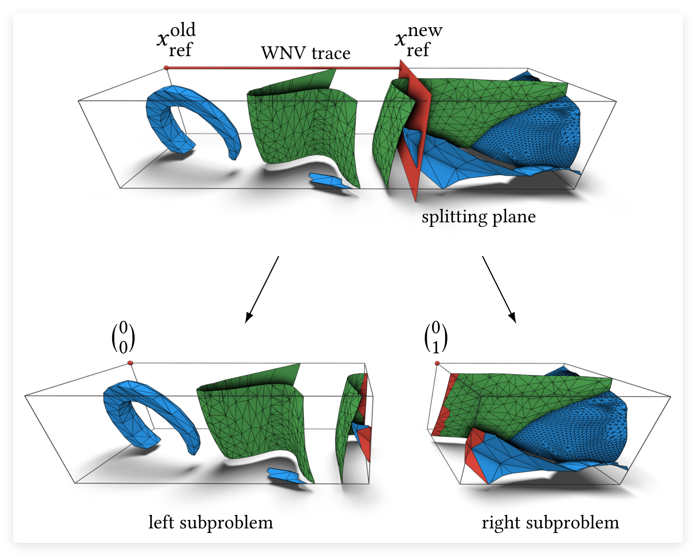
**图 4.** 作为整体细分结构的一部分，子问题在轴对齐平面上进行分割。该平面位于重心位置，并朝向方差最大的轴方向。大多数多边形在此分割中保持不变（受影响的多边形以红色显示）。为保持叶节点计算的局部性，我们需要一个局部参考点及其环绕数向量。在本示例中，先前的参考点位于左半部分。对于右子问题，我们将 $x _ { \mathrm { r e f } } ^ { \mathrm { o l d } }$ 投影到右侧轴对齐包围盒上，并通过线段追踪计算其环绕数向量。
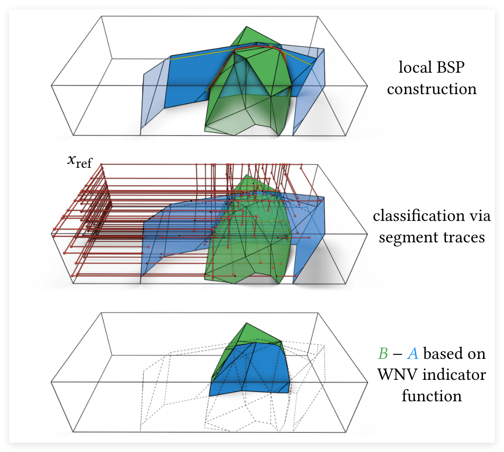
**图 5.** 我们细分结构中叶节点的计算是完全局部的。首先计算两两相交并构建每个多边形的二叉空间分割（新边以黄色显示，仅相交多边形为不透明）。然后通过向已知环绕数向量的局部参考点 $x _ { \mathrm { r e f } }$ 追踪线段路径对每个叶节点二叉空间分割多边形进行分类。分类结果是一对环绕数向量，随后通过指示函数筛选，仅输出那些具有“出-入”或“入-出”转换的多边形。

通常还会提供运算符指示函数 $f_{\mathrm{op}} : \mathrm{WNV} \to \{\mathrm{out}, \mathrm{in}\}$。对每个多边形计算 $(f_{\mathrm{op}}(\mathbf{w}_F^{t^\prime}), f_{\mathrm{op}}(\mathbf{w}_B^{t^\prime}))$。若结果为 (out, in) 则保留该多边形，若为 (in, out) 则反转其顶点顺序。(in, in) 和 (out, out) 将被丢弃。这可以作为后处理步骤完成，但若在创建 $S^\prime$ 过程中利用 $f_{\mathrm{op}}$ 的知识，当能证明某些区域仅产生 (out, out) 或 (in, in) 多边形时直接丢弃整个区域，效率将显著提升（参见第 4.5 节）。

# 4.1 概述

给定标注有环绕数转换向量 $\Delta \mathbf { w } ^ { \mathbf { t } }$ 的多边形集合 $t \in S$，我们的算法递归执行细分和叶节点计算。场景包围盒的自适应细分递归进行，直至局部问题规模足够小，可通过二叉空间分割和环绕数追踪直接求解。在此细分阶段，我们不仅传播位于各子包围盒内的多边形集合，还传播已知环绕数向量的参考点。通过这种方式，我们可以利用相交多边形的环绕数转换向量，通过线段追踪局部确定每个分区的环绕数向量。参考点传播避免了构建全局加速结构的需求。由于递归细分提供了多种提前终止条件，层次结构的很大部分无需生成。

更具体地说，细分任务（参见图 4）执行以下步骤：

• 将轴对齐包围盒分割为两个子包围盒

• 对每个子包围盒 $B$：

– 将每个 $t \in S$ 相对于 $B$ 进行裁剪

– 若 $x _ { \mathrm { r e f } } \notin B$，通过从 $x _ { \mathrm { r e f } }$ 出发的线段追踪计算新参考点及其环绕数向量

– 使用裁剪后的 $S$、子包围盒及可能更新的 $x _ { \mathrm { r e f } }$ 递归调用算法

叶节点任务（参见图 5）对每个多边形 $t \in S$ 执行以下操作：

• 构建局部二叉空间分割

– 将 $t$ 与 $S$ 中所有其他多边形求交

– 将每个相交线段加入二叉空间分割

• 对局部二叉空间分割中的每个叶节点多边形 $f$：

– 向 $x _ { \mathrm { r e f } }$ 追踪线段以计算 $( \mathbf { w _ { F } ^ { t } } , \mathbf { w _ { B } ^ { t } } )$

– 输出 $( t , \mathbf { w _ { F } ^ { t } } , \mathbf { w _ { B } ^ { t } } )$

核心洞见在于：通过跟踪 $x _ { \mathrm { r e f } }$ 和 $\mathbf { w } _ { \mathrm { r e f } }$，我们始终可以使用保持在子包围盒内的线段追踪进行局部分类。理想情况下，问题规模随每次细分减半，从而实现对数级递归深度和线性整体内存需求。各步骤细节将在后续章节阐述。

## 4.2 细分与裁剪

若当前子问题包含过多多边形，穷举式两两相交测试将极其耗时。因此，我们尝试缩减问题规模直至两两测试可行。我们将每个子问题的包围体保持为整数坐标的简单轴对齐包围盒。细分即沿某一轴线在整数位置进行分割。虽然选择最长轴中点
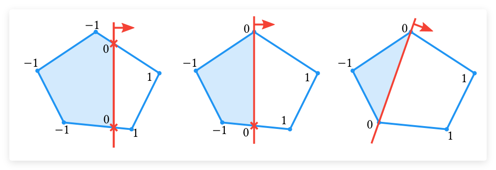
**图 6.** 使用分类法将凸多边形相对于平面裁剪是直观的。每个顶点被分类为 −1、0 或 1。从 −1 到 1 的边被分割。结果可由一侧的所有非正顶点和另一侧的所有非负顶点组装而成。裁剪需要通过相交操作创建 0、1 或 2 个新顶点。图中展示了每种情况的示例。

可实现均衡且相对高效的细分，但我们将在第 4.5 节讨论更精细的策略。

### 4.2.1 多边形裁剪 
给定分割平面 $s$，细分过程创建“左”和“右”子问题，并递归调用完整方法处理。每个标注多边形集合中的多边形相对于分割平面进行裁剪，因此要么加入单个子问题，要么分割为两部分加入两个子问题。我们将恰好位于分割平面上的多边形分配给“左”子问题。

裁剪（凸）多边形 $v _ { 1 } , \ldots , v _ { n }$ 很简单（参见图 6）。首先，我们使用公式 4 计算每个顶点 $v _ { i }$ 相对于分割平面的分类 $c _ { i } \in \{ - 1 , 0 , 1 \}$。若无正值，多边形属于“左”侧；若无负值，则属于“右”侧；全零值分配给“左”侧。

仅当同时存在负值和正值时才需实际分割。对于每条连接 −1 和 1 的边，利用支撑平面、边平面和分割平面构造一个新顶点。之后，即使分割平面恰好经过一个或两个多边形顶点，也恰好存在两个分类为 0 的顶点。所有非正顶点构成“左”侧多边形，所有非负顶点构成“右”侧多边形。由于每个顶点都是原始（经过适当量化的）多边形与轴对齐包围盒面相交的结果，它们始终可用我们的齐次整数坐标表示。

### 4.2.2 更新参考点。
为保持局部分类每个多边形的能力，我们需要在每个子问题中某个位置具有已知的环绕数向量。通常，其中一个半区已有这样的位置，但另一个半区没有。因此，我们需要在另一半区选择一个非表面位置，并通过第 3.4 节描述的从给定参考点到新参考点的线段追踪来计算其环绕数向量。类似于第 4.4 节的分类，这最多需要追踪三条线段。**若中间点位于表面上，或任何追踪线段位于多边形内部或接触边，则该路径不可用于分类。** 然而，只要新参考点位于第二子问题内且路径不离开当前轴对齐包围盒，我们可自由选择路径。仅当路径遇到退化配置时才无效，在绝大多数情况下第一条路径即有效；若无效，通常能在很少迭代内找到有效路径。

出于性能考虑，我们倾向于选择线段更少且轴线对齐的路径。这些路径需要

更低的精度和更少的相交测试。因此，我们首先尝试将先前参考点投影到新子问题的轴对齐包围盒上。在绝大多数实际情况下，这会产生一条以整数位置为终点、可通过单条轴线对齐线段追踪到达的有效路径。示例如图 4 所示。

## 4.3 通过局部构建BSP处理面-面相交

当子问题规模足够小，使得多边形数量的二次复杂度可接受时，即可进行相交计算与分类。本节描述相交求解过程，下一节将涵盖分类方法。关于子问题“足够小”的具体标准将在第4.5节讨论。

在叶节点任务中，我们面对的是存在自相交的凸多边形集合。目标是计算一组覆盖相同表面区域且无自相交的凸多边形。

常规策略是计算所有成对相交线段，并将其嵌入各自的多边形中。随后对结果进行重新三角剖分（例如采用[Zhou et al. 2016]使用的Delaunay三角剖分）。对于共面面片需特别注意。

我们基于以下原因开发了不同策略：最重要的是，在使用固定精度齐次坐标的表述体系中，重新三角剖分通常不可行（参见第3.2节）。即使可行，Delaunay三角剖分本身计算成本较高。此外在CSG场景中，此类三角剖分常导致顶点度数极高。

我们的基于平面的表述体系强调边与定义多边形的平面，倾向于切割操作，避免直接对顶点坐标操作。因此，我们将整个相交步骤构建为BSP构造过程：对每个多边形$t$构建临时局部BSP。非叶节点标注分割平面，叶节点包含表示几何形状的多边形。需注意，这里BSP并非用作包含相交线段的加速结构，而是作为几何表示方式：最终BSP构成多边形$t$的无交并分区，且所有BSP叶节点内部不存在相交。除重叠情况外（后续处理），所有相交均位于叶节点边界。

初始配置仅为包含$t$几何形状的叶节点。构造过程仅支持单一操作：向BSP“添加”线段$(v_0, v_1, s)$。其中$v_0$和$v_1$是线段顶点，$s$是与多边形支撑平面$s_t$共同定义线段所在直线的平面。与递归数据结构的大多数过程类似，该操作递归定义为向BSP节点$n$“添加”线段：

• 若$n$是以平面$q$分割的内部节点
– 计算$c_0 := \operatorname{classify}(v_0, q)$ 和 $c_1 := \operatorname{classify}(v_1, q)$
– 当$c_0 = c_1 = 0$时停止（线段位于分割平面）
– 若$c_0 \leq 0$ 且 $c_1 \leq 0$，仅向左节点添加线段
– 若$c_0 \geq 0$ 且 $c_1 \geq 0$，仅向右节点添加线段
– 若$c_0 < 0$ 且 $c_1 > 0$：
$^*$ 计算新顶点$v^\prime := \operatorname{intersect}(s, q, s_t)$
$^*$ 向左节点添加线段$(v_0, v^\prime, s)$
$^*$ 向右节点添加线段$(v^\prime, v_1, s)$
– （若$c_0 > 0$ 且 $c_1 < 0$，处理方式类似）

• 若$n$是叶节点：
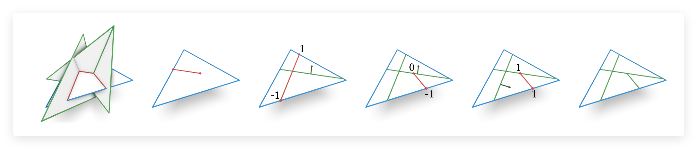
图7. 局部BSP通过添加相交线段构建。每个包含线段非平凡部分的叶节点都会被分割。图示为包含三条相交线段（红色）的三角形，这些线段被添加到BSP中（现有分割平面为绿色）。数字表示线段顶点对当前BSP节点平面的分类结果。注意虽然每条相交线段最终位于绿色BSP分割平面，但反之不成立：本例中第一条相交线段导致的分割超出必要范围。这种保守分割保持每个单元凸性，形成简单快速的方法。
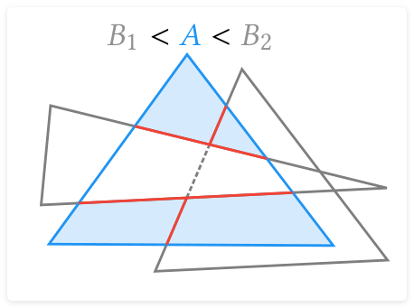
图8. 三个重叠三角形的俯视图。重叠多边形在BSP构建过程中被妥善处理。给定输入多边形全序（如索引），若叶节点被“较低”多边形重叠则禁用。这保证重叠区域至多贡献一次结果。本例中当前三角形$A$被两个重叠三角形切割，但仅有浅蓝色部分会被进一步分类并可能贡献结果，因为$B_1 < A$而$A < B_2$。

– 使用$s$分割叶节点多边形（参见第4.2.1节）
创建以$s$为分割平面的内部节点，以及两个包含分割结果的新叶节点。

现在考虑所有其他多边形$t^\prime$（支撑平面为$s_{t^\prime}$）。$t$与$t^\prime$的相交可通过相交和分类操作计算，结果属于以下情形：

(C1) 无相交
(C2) 单点相交
(C3) 非退化线段$\left(v_0, v_1, s_{t^\prime}\right)$
(C4) 非空重叠多边形

(C1)和(C2)可安全忽略。(C3)直接加入BSP，但若线段位于边或已有分割上，可能不会产生新叶节点（图7示例）。

重叠情形(C4)稍复杂：首先将$t^\prime$所有边加入BSP。由于$t^\prime$执行对称操作，最终在$t$和$t^\prime$中得到表示相同表面几何的叶节点，因而具有相同WNTV（即相同分类）。为满足重叠区域无交性保证，我们“禁用”除一个多边形外的所有叶节点。给定多边形全序（如输入索引），当$t > t^\prime$时，直接在$t$的BSP中将重叠区域标记为“禁用”。因此，在任何重叠区域中，仅最小索引的多边形产生输出多边形（参见图8）。

此步骤结束时，我们获得多边形$t$的局部BSP，所有相交线段均已“添加”。通过构造保证，没有叶节点多边形内部与其他多边形相交。每个BSP正如其名，是$t$的一个分区。结合重叠处理，启用的叶节点多边形集合与输入表示相同几何形状，且无自相交，满足初始保证(P1)和(P2)。
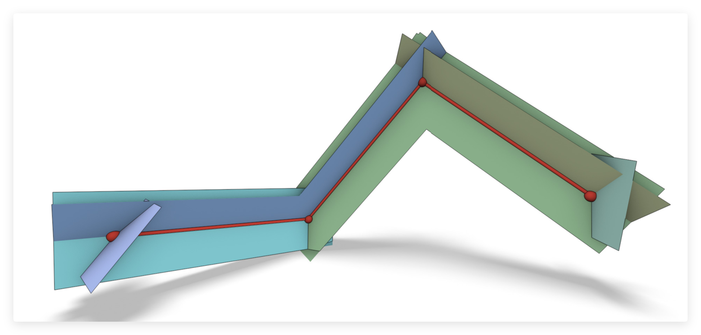
图9. 对于齐次坐标中的两点，通常无法在精度范围内直接构建连接线段。但对于分类，我们仅需两点间的路径。每个点由三个平面相交定义，通过每次改变一个平面，总能用最多三个线段构建两点间的路径。

## 4.4 基于线段追踪的面分类

在（P1）和（P2）的保证下，每个启用叶子多边形 $t$ 的内部都具有明确定义的缠绕数向量对 $( \mathbf { w _ { F } ^ { t } } , \mathbf { w _ { B } ^ { t } } )$。我们仍处于子问题的计算过程中，即给定一个带标注 $\Delta \mathbf { w } ^ { \mathbf { t } }$ 的多边形集合 $S$、一个轴对齐包围盒（AABB）以及一个具有缠绕数向量 $\mathbf { w } _ { \mathrm { r e f } }$ 的参考点 $x _ { \mathrm { r e f } }$。数学基础已在第3.4节中阐述。然而，该描述假设分类的目标位置 $x$ 已知，且从 $x _ { \mathrm { r e f } }$ 到 $x$ 的线段可定义。一般情况下，我们无法通过两个非整数位置定义线段（参见第3.2节）。此外，分类可能“失败”，即路径不适用于缠绕数向量传播，例如因为线段接触了输入多边形的边缘。

我们从一个适用于大多数场景且计算简单的启发式方法开始：使用常规浮点数计算 $t$ 的重心，并将其舍入到最近的整数坐标 $c$。接着，定义一条从 $c$ 出发的轴对齐直线，其方向与 $t$ 的法向量最接近对齐（即和多边形“最不平行”的轴对齐选择）。现在，使用精确算术计算该直线与 $t$ 的交点。若存在与 $t$ 内部的交点，我们构建一个最多由3段线段组成的简单轴对齐路径（参见图5）。
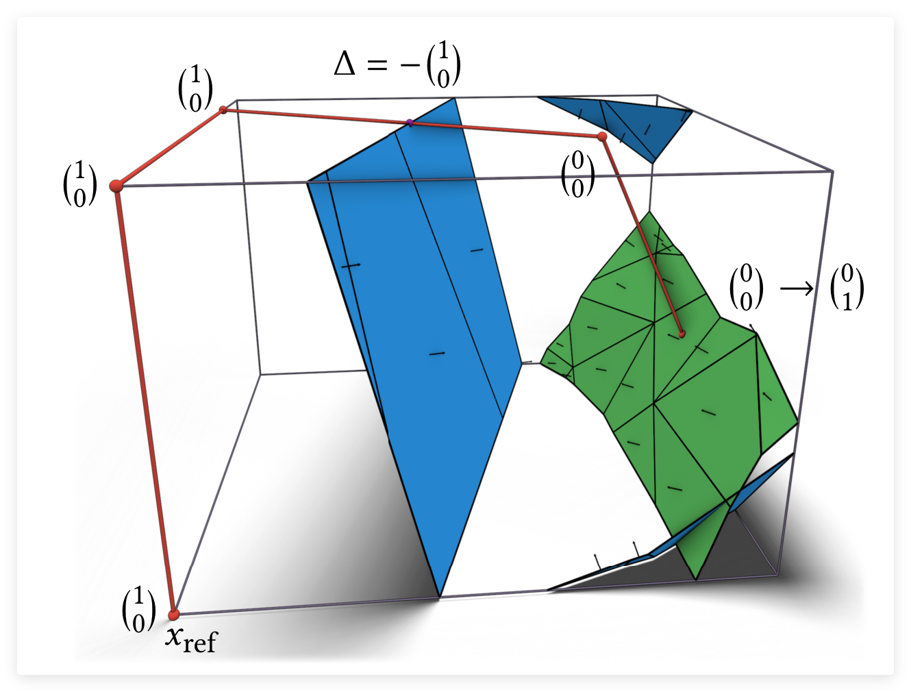
图10. 在对局部子问题的多边形进行分类时，我们从已知缠绕数向量的参考点追踪一条路径至多边形内部的任意点。两点间的3段路径构造可能超出子问题的轴对齐包围盒，因此路径需额外按包围盒进行裁剪。

若此构造失败（可能因直线未与 $t$ 相交，或分类路径无效），则采用更复杂的构造方法，包含两个子步骤。首先，按如下方式计算 $t$ 内部的一个点：

(1) 选取由支撑平面 $s _ { t }$ 与边平面 $s _ { e _ { 0 } } = ( a _ { 0 } , b _ { 0 } , c _ { 0 } , d _ { 0 } )$ 和 $s _ { e _ { 1 } } = \left( a _ { 1 } , b _ { 1 } , c _ { 1 } , d _ { 1 } \right)$ 定义的任意多边形顶点。

(2) 定义 $s _ { e _ { 0 } } ^ { \prime } = ( a _ { 0 } , b _ { 0 } , c _ { 0 } , d _ { 0 } + i _ { 0 } )$ 和 $s _ { e _ { 1 } } ^ { \prime } = ( a _ { 1 } , b _ { 1 } , c _ { 1 } , d _ { 1 } + i _ { 1 } )$，其中 $i _ { 0 } , i _ { 1 } \in \mathbb { N } _ { \geq 1 }$ 为（随机化的）偏移量。

(3) 计算 $x = \operatorname{intersect}(s_t, s_{e_0}^\prime, s_{e_1}^\prime)$。

(4) 若 $x$ 不在 $t$ 的内部，则返回步骤（1）。

$x$ 始终位于 $t$ 的支撑平面上。偏移量 $i_0$ 和 $i_1$ 恒为正，从而将 $x$ “推入” $t$ 的内部。步骤（4）的迭代特性确保 $x$ 不会被移动“过远”。$s_{e_0}$ 和 $s_{e_1}$ 的平面系数可被放大，使 $i_0$ 和 $i_1$ 的步长更精细。实践中，我们持续放大系数直至最大系数接近精度极限，并初始设置 $i_0 = i_1 = 1$。这通常已足够，仅特殊构造的极端情况需要多次迭代。

第二步将 $x$ 与 $x_{\mathrm{ref}}$ 连接。假设 $x$ 和 $x_{\mathrm{ref}}$ 分别由三个平面 $(s_0, s_1, s_2)$ 和 $(r_0, r_1, r_2)$ 的交点定义。考虑由 $(s_0, s_1, r_2)$ 定义的点 $x_1$。$x$ 和 $x_1$ 均位于平面 $s_0$ 和 $s_1$ 上，因此位于直线 $(s_0, s_1)$ 上。于是，$(s_0, s_1, s_2, r_2)$ 构成从 $x$ 到 $x_1$ 的线段。类似地，可通过 $(s_0, r_1, r_2)$ 定义 $x_2$。由此得到从 $x$ 到 $x_{\mathrm{ref}}$ 的路径 $(x, x_1, x_2, x_{\mathrm{ref}})$，其中每个中间线段和点均可在精度范围内定义。

第二种构造通过迭代地将定义 $x$ 的平面替换为定义 $x_{\mathrm{ref}}$ 的平面来实现。实际替换顺序无关紧要，这为我们在路径无效时（例如追踪过程中碰到多边形边缘）提供了选择不同顺序的自由。路径 $(x, x_1, x_2, x_{\mathrm{ref}})$ 可能超出子问题的轴对齐包围盒，此时需根据包围盒平面进行裁剪。图9和图10展示了示例。
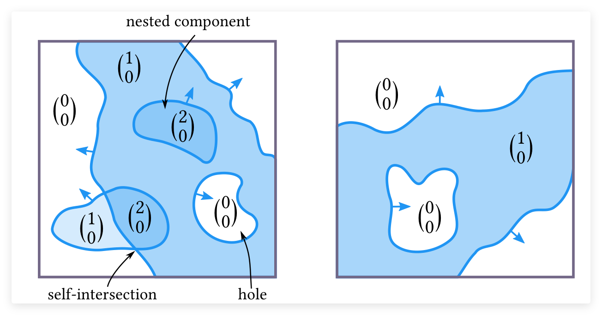
图11. 通常，我们可获得额外的输入保证。当子问题仅包含一种缠绕数向量类型时，可利用这些保证。若每个输入自身无自相交，则可跳过局部BSP构造步骤；若无嵌套组件，则单次分类对所有包含的表面均有效。左侧为无此类保证的示例，右侧为具备保证的示例。注意右侧表面始终从 $\binom { 0 } { 0 }$ 过渡到 $\textstyle { \binom { 1 } { 0 } }$。

这些构造的核心在于：我们有一个简单的默认方案适用于绝大多数情况。借助精确算术，我们能准确判断构造何时不足，并切换到更复杂的方案。

最终，每个启用的叶子多边形 $f$ 都得到一个 $(\mathbf{w}_F^{\mathbf{f}}, \mathbf{w}_B^{\mathbf{f}})$ 对。所有这些多边形共同满足第4节开头提出的严格保证。若给定了运算符指示函数，可直接输出生成的几何体。

## 4.5 优化

前几节介绍了建立直觉和理解该方法如何计算精确正确结果及其预期时间和空间复杂度的所有必要步骤。然而，我们还声称我们的方法在真实世界数据上极其快速。为实现这一点，我们提出一些算法和实现优化，这些优化既不影响正确性，也不影响渐近复杂度，但在适当情况下仍能将性能提升数个数量级。

### 4.5.1 利用额外输入假设。

我们方法的输入是一个多边形汤 $S$，其中每个多边形 $t$ 都标注有缠绕数转换向量 $\Delta \mathbf { w } ^ { \mathbf { t } }$。直观上，所有具有相同 WNTV 的多边形对应于单个输入网格。虽然不同网格通常相互交叉，但我们通常知道每个单独网格 $S _ { i }$ 是无自相交且不包含嵌套组件的。特别是，我们方法产生的任何网格都满足这些假设。因此，我们允许每个“WNTV 类”被标记为无自相交（NSI）和/或无嵌套组件（NNC）。这些将在后续优化中使用。例如，一个仅包含单一 WNTV 类型的叶子子问题通常仍需要局部 BSP 构建和分类。然而，如果该 WNTV 被标记为 NSI，则可以跳过 BSP 构建。如果它进一步被标记为 NNC，则只需分类单个多边形，因为所有其他多边形将产生相同的 $( \mathbf { w _ { F } ^ { t } } , \mathbf { w _ { B } ^ { t } } )$。图 11 展示了一个例子。

### 4.5.2 早期细分终止。

即使没有额外假设，操作符指示函数本身也提供了大量提前退出的机会。例如，考虑给定两个网格 $A$ 和 $B$（其 WNV 分别为 $( 1 , 0 )$ 和 $( 0 , 1 )$）时计算 $A - B$，
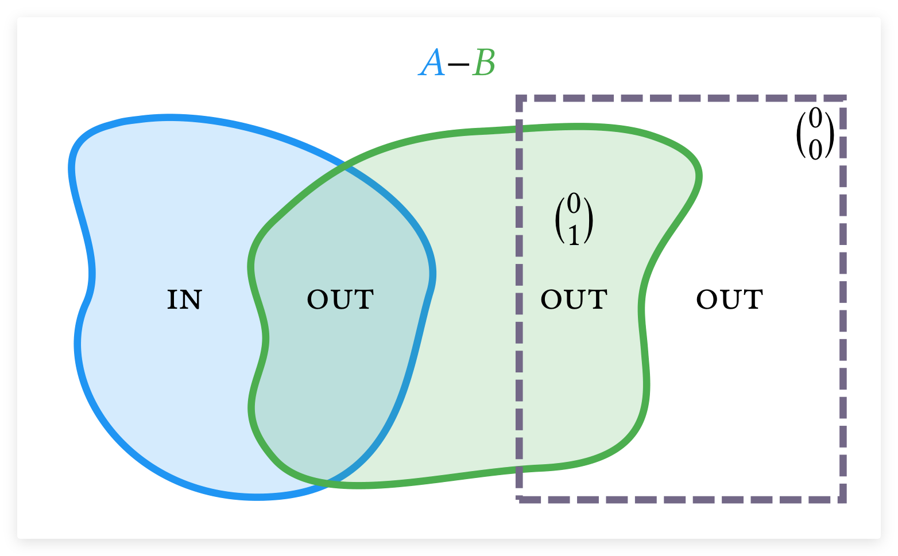
图 12：即使没有额外的输入假设，某些配置也允许优化。在这个差集操作中，突出显示的子问题的参考 WNV 为 $( 0 , 0 )$，并且仅包含 $( 0 , 1 )$ 网格的面。对于布尔差集，只有形式为 $( z , 0 )$ 且 $z \neq 0$ 的 WNV 才会被分类为“内部”。子问题中的任何 WNV 轨迹都形如 $( 0 , 0 ) + k \cdot ( 0 , 1 )$，因此永远不可能为“内部”。因此，这个特定的子问题永远不会对结果有贡献。

通常，一个仅由 $B$ 的多边形组成的子问题，如果 $B$ 既不是 NSI 也不是 NNC，则需要完全细分和分类。然而，如果当前参考 WNV 的形式为 $(0, b)$，则可以立即丢弃该子问题：$A - B$ 的指示函数仅在 WNV 形式为 $(a, 0)$ 且 $a \neq 0$ 时为“内部”。当前子问题的分类起始于参考 WNV $(0, b)$。由于只存在来自 $B$ 的多边形，因此任何用于分类的 WNV 形式均为 $(0, b + z)$，其中 $z \in \mathbb{Z}$。因此，无需任何进一步的细分和分类，我们已经知道所有多边形都将被分类为（外部，外部），从而被丢弃（参见图 12）。

所有布尔操作都存在此类规则。虽然实际规则因操作而异，但它们可以机械地计算，非常类似于有限自动机上的可达性分析。这种优化对于可变元操作尤其有效。在铣削模拟中，从初始工件 $W$ 中减去“刀具”网格的许多实例 $T _ { i }$。现在考虑计算 $W { - } T _ { 1 } { - } \dotsb { - } T _ { n }$。同样，指示函数仅在位于 $W$ 内部且在所有 $T _ { i }$ 外部时为“内部”。计算出的优化规则是：

• 如果在 $W$ 外部但子问题不包含 $W$，则丢弃。

• 如果在某个 $T _ { i }$ 内部，但该 $T _ { i }$ 不是子问题的一部分，则丢弃。

### 4.5.3 分割策略。

任何空间细分方案的一个重要方面是在哪里分割以及何时停止。我们的基线策略是将最大的 AABB 轴对半分，并在多边形总数低于阈值时停止。性能分析显示两个主要性能热点（参见图 16）：

(H1) 在早期细分过程中测试和分割多边形
(H2) 在叶子节点中进行 BSP 构建和多边形分类

(H1) 开销高昂是因为必须测试大量多边形。通过前面描述的提前退出策略，(H2) 自然集中在不同输入网格相交的地方。

因此，一个好的细分策略必须尽可能高效地减少早期层次中的总多边形数量。对于大多均匀且各向同性的细分，基线策略已经相当有效。我们测试的另一种常见策略是沿着最大方差轴在多边形的重心处分割集合。当细分或多边形分布不太均匀时，这会导致更有效的细分。实际上，只应使用多边形的子集来确定分割平面，否则寻找分割平面的成本会超过实际分割的成本。许多更复杂的策略都面临同样的陷阱：计算成本高于节省的成本。我们在实现中采用的策略很简单，但试图利用提前退出的行为。多边形汤 $S$ 被存储为一组具有统一 WNTV 的汤 $S _ { i }$。

• 计算每个子汤 $S _ { i }$ 的重心 $c _ { i }$
• 考虑每个其他 $S _ { j }$ 的 AABB 平面 $\boldsymbol { p }$
• 如果 $\mathcal { P }$ 将 $c _ { i }$ 与 $S _ { j }$ 分离，则将其添加到分割平面候选
• 返回具有最远分离距离的候选
• 如果未找到候选，则回退到最大方差分割

该策略在很大程度上保持了“中位分割”的精神，但所有候选都保证一个子问题不会包含 $S _ { j }$，从而增加了提前退出策略生效的机会。

在细分的后期，子问题包含更少但更大的多边形。这不可避免地降低了细分效率，因为任何与分割平面相交的多边形最终都会出现在两个递归分支中。结果是两种相反的趋势：

更多细分导致更小的叶子子问题，从而降低每个叶子的运行时间。另一方面，所有叶子子问题的总多边形数量增加，从而推高运行时间。最佳平衡点
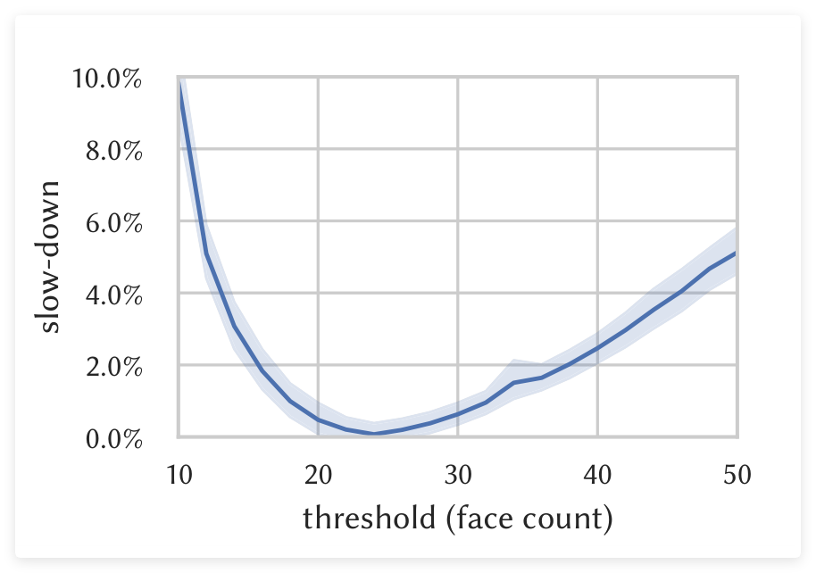
难以预测，并且取决于许多因素。插图展示了我们基于基准数据集确定阈值的实验。最佳值在 25 个多边形处，但速度下降足够小，因此精确值并不太重要。

## 4.5.4 并行实现。

我们的方法经过精心设计，使得每个细分步骤基本上是一个纯函数：当前子问题的结果多边形仅依赖于局部数据。进一步的细分、BSP 构建和分类仅需要给定的多边形汤以及参考点及其 WNV。因此，整个递归过程非常适合工作窃取方法：一个线程池维护一个中央同步队列 $Q$，其中存储子问题。在每个细分步骤中，算法仅递归处理一个子问题，另一个则添加到 $Q$ 中。当线程空闲时，它们从 $Q$ 中取出并处理新的子问题。一旦前几次细分发生，$Q$ 中就包含足够的子问题来饱和任何典型工作站的核。这种简单策略已经实现了有效的并行化（参见第 5.3 节）。

### 4.5.5 重要的实现细节。

作为本节的最后部分，我们提到一些实现细节，这些细节对理解实际方法本身没有太多帮助，但对于实现最大性能至关重要。

大多数高性能计算最终都会受到内存限制，无论是延迟还是带宽。我们确保尽可能减少分配并重用内存。细分结构和纯局部计算极大地帮助了这一点：一旦递归的一个分支返回，该分支中分配的所有内存都可以被重用。

在所有地方都使用完整的 256 位算术是不必要的保守做法。轴对齐平面和直线的各种系数是 −1、0 或 1。许多中间结果可以安全地使用减少的位大小来计算。与任意精度整数相比，所有这些约束都是静态已知的，并使用单独的类型实现。

当然，我们也利用了常见的保守 AABB 检查技术，只要可能就进行。特别是，线段追踪在实际计算任何交点之前总是执行 AABB 测试。

# 5 评估

所有基准测试均在 Intel i9-9900K 处理器上进行，主频为 $3.60 \mathrm{GHz}$（加速可达 5.00 GHz）。由于最先进的方法是并行的，我们使用自己的并行实现进行比较。代码使用 C++ 编写，用 clang-12 编译，并启用 `-O3` 优化。

## 5.1 Thingi10K 基准测试与对比

对 CSG 算法进行具有代表性的性能基准测试历来十分困难。为贴近实际应用场景，我们采用以下设置：以 Thingi10K 数据集 [Zhou and Jacobson 2016] 作为真实世界模型集合，这些模型在面片数量、三角形各向异性及细分质量上具有广泛分布。常见的基准测试方法是计算每个模型与其轻微旋转版本的自相交。然而，这似乎与真实世界的 CSG 操作相去甚远。作为更优替代方案，我们提出并采用以下操作流程：

• 从数据集中随机选取两个网格模型。
• 对两者施加随机变换，使其包围盒大部分重叠。
• 执行基础布尔运算并测量性能。

图 15 展示了该流程的实例。我们认为这种方法更接近实际 CSG 使用场景。每个输入对包含具有不同复杂度、各向异性和细分质量的网格。变换操作确保了相交与非相交网格区域的充分混合。轻微旋转的自相交测试或许能压力测试 CSG 算法的相交处理能力，但在实际应用中，高效处理网格的非相交部分同样至关重要。

虽然 [Zhou et al. 2016] 与我们的方法能处理任意 PWN 网格，但多数其他方法需要更强的输入假设。因此在实际对比中，我们将数据集限制为 1000 个无自相交的流形实体网格，面片数量介于 1000 至 100000 之间。下限值排除了简单网格，未设上限时某些方法会在测试机上超出时间和内存限制。补充材料中提供了完整的基准测试数据，包括网格 ID 对与变换矩阵。

我们对比了 QuickCSG [Douze et al. 2017]、Cork [Bernstein 2013]、CGAL [Hachenberger et al. 2007]（Nef 结构、惰性精确计算）、网格排列法 [Zhou et al. 2016] 及浮点网格排列法 [Cherchi et al. 2020]。需注意现有实现

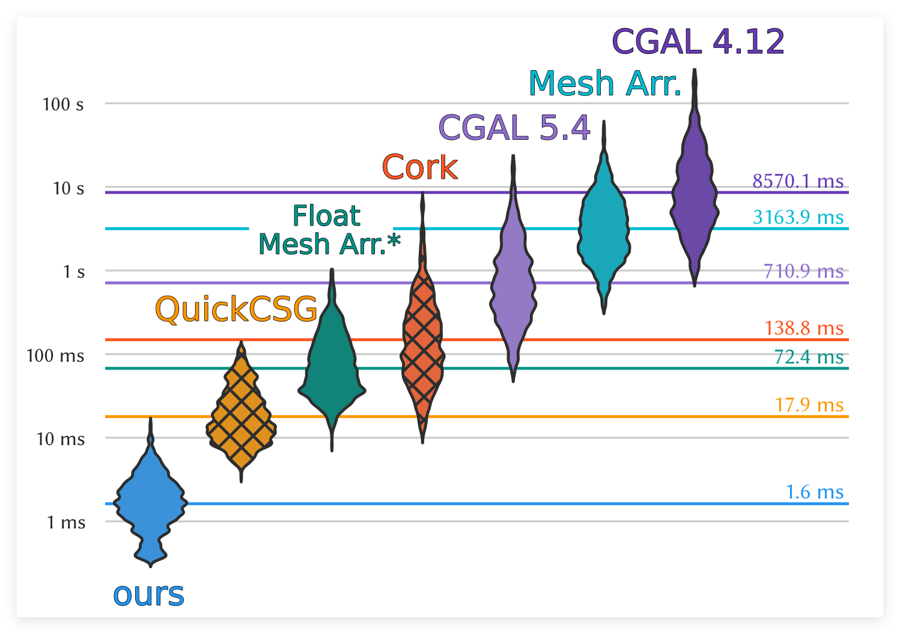

图 13. 各 CSG 方法在 Thingi10K 数据集中 1000 对网格（面片数 1000-100000）上的耗时分布直方图。非精确方法用交叉阴影表示。彩色水平线显示几何平均性能，详细讨论见第 5.1 节。特别说明浮点网格排列法的参考实现仅包含自相交解析功能。注意纵轴为对数刻度，数值越低越好。

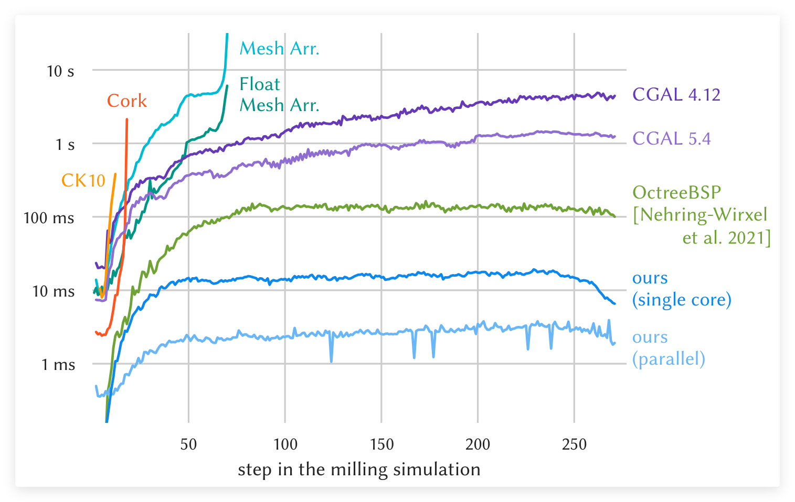
图 14. 钻头从工件重复减除的迭代 CSG 场景基准耗时。原始基准测试与网格数据由 [Nehring-Wirxel et al. 2021] 提供（参见其图 13、图 14 及相关讨论）。末尾的下降段（在我们单核版本中最为明显）源于钻头离开工件区域。注意纵轴为对数刻度，数值越低越好。

对 [Cherchi et al. 2020] 仅包含自相交解析功能，未实现实际分类与 CSG 操作。虽然自相交解析曾是原始网格排列法的瓶颈，但考虑到性能差异，此情况可能已改变。此外，仅在该方法的基准测试中，代码按参考实现要求使用 gcc-10 编译。
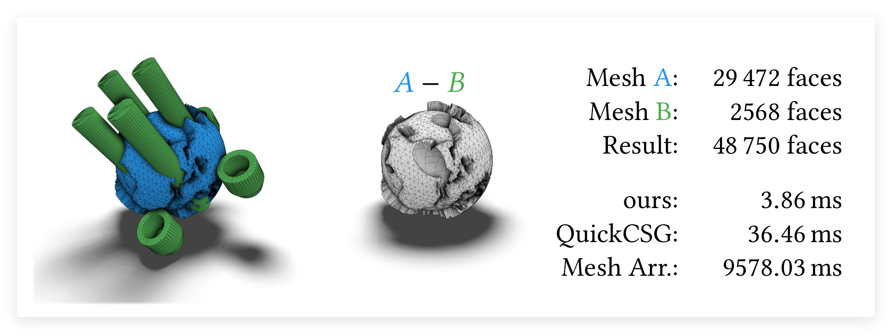

图 15. 基于 Thingi10K 的测试数据集示例。此处我们仅与 QuickCSG [Douze et al. 2017] 和网格排列法 [Zhou et al. 2016] 对比。所有实现均为多线程版本，测试在同一机器进行。注意仅网格排列法与我们的方法能产生精确结果。

在所有对比方法中，仅我们的方法、两种网格排列法及 CGAL 具有精确性。QuickCSG 和 Cork 经常产生拓扑与几何错误的结果，有时甚至出现灾难性错误。特别是退化或近退化配置更容易失败。

传统上，精确方法比非精确 CSG 方法至少慢一个数量级。图 13 的基准测试表明我们扭转了这一局面：我们的方法比所对比的最快非精确 CSG 方法快约一个数量级。几何平均每次网格布尔运算耗时 1.6 毫秒，对应输入规模约 20000 个面片。在整个基准测试中，我们每秒能处理约 1500 万个输入三角形。

图 14 展示了 [Nehring-Wirxel et al. 2021] 铣削模拟的每步耗时（参见其图 13 与图 14）。这种迭代 CSG 场景因输入复杂度不对称而极具挑战性：工件变得极其复杂，而钻头却小而低模。[Nehring-Wirxel et al. 2021] 的方法通过将有限复杂度的 BSP 嵌入持久八叉树数据结构来优雅处理此问题。但 BSP 布尔运算的成本显著高于我们的方法，这使得即使每步需重新计算细分结构，我们仍能超越其性能。未来工作中，我们预期通过持久化保存隐式 kd 树而非每步重建，将带来显著的性能提升。

# 5.2 性能分解

图 16 展示了算法各步骤对总运行时的贡献度在基准数据集上的分布情况。从宏观看，我们的方法包含细分与叶节点计算两大阶段。通常叶节点计算耗时是细分阶段的两倍，但实际任务差异会导致显著波动：具有大量非相交部分的网格能通过细分提前终止大幅受益，所需叶节点计算更少。

细分阶段主要包含多边形相对于分割平面的切割操作。虽然单次切割成本不高，但极端庞大的执行次数会累积成显著开销。若分割平面计算策略需遍历所有多边形则成本较高，但通过限定子集常可控制此开销。更新参考缠绕数向量需要在

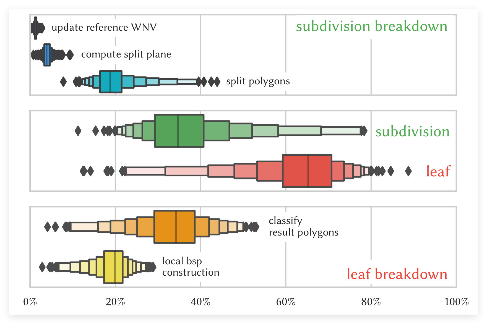

图 16. 基准数据集上运行时性能的相对分布。多数配置中叶节点耗时是细分阶段的两倍。细分阶段以多边形切割为主。叶节点中，分类线段追踪耗时几乎是成对相交计算与解析的两倍。
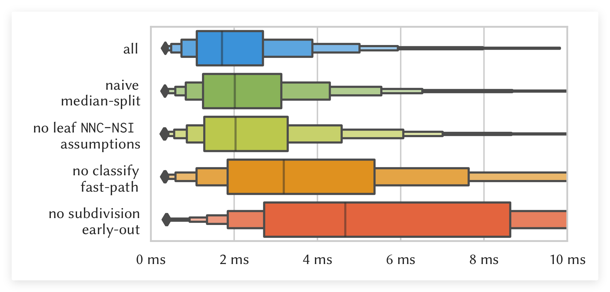

图 17. 消融研究展示单独禁用各优化对运行时的影响。耗时分布基于我们的基准数据集呈现。

所有子问题多边形上进行线段追踪。令人惊讶的是，这在性能剖析中几乎不显眼。这些追踪往往轴对齐且位于 AABB 边界，因此效率极高。

叶节点计算的最大开销来自多边形分类（即向参考缠绕数向量追踪线段）。成对相交解析与逐面 BSP 构建位居第二。

图 17 通过消融研究补充了此分析。通过单独禁用各项可配置优化来展示其对总运行时的影响。两大最显著的性能增益来自快速路径分类（对比图 5 与图 10）和细分阶段的提前终止（对比图 11 与图 12）。

# 5.3 并行化

如第 4.5.4 节所述，采用工作窃取的并行化策略具有合理的扩展性。图 18 (a) 展示了随线程数增加的速度提升因子。对于 8 物理核心的 CPU，超过 8 线程的扩展收益递减，主要受限于超线程技术。实践中完全线性扩展难以实现，因为方法中许多部分受内存带宽而非计算能力限制。此外，图 18 (b) 展示了
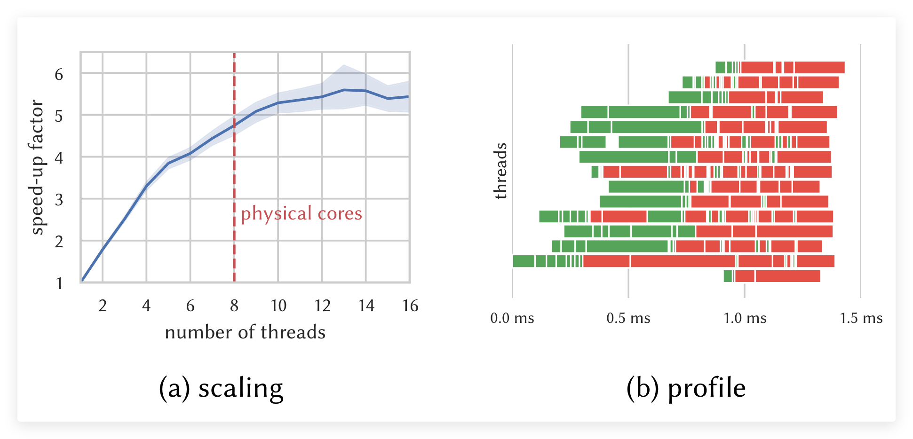
图 18. (a) 在 8 物理核心 CPU 上，我们的方法随线程数增加的扩展性。速度提升显著但非完全线性，因内存带宽趋于饱和且方法初始阶段扩展性有限。浅蓝色区域显示测试数据集上的波动范围。(b) 采用工作窃取策略的并行化性能剖析代表案例，包含细分任务（绿色）与叶节点任务（红色）。每个细分任务产生两个新任务。由于初始仅有一个任务，完全并行化需经过数次细分后才实现。

工作窃取方法的典型性能剖析。我们从单个细分任务开始，该任务派生出两个新任务，每个新任务又继续派生出两个任务。因此方法初始存在“预热”阶段直至达到完全并行化。尽管如此，在 8 核 CPU 上实现 $5.5 \times$ 加速比仍是令人满意的结果。

# 5.4 应用实例

我们通过若干实例与应用来总结评估。图 19 展示了几组大型模型间的布尔运算及耗时。由于每个结果多边形都是输入多边形的子集，可通过重心坐标权重将输入属性（如图 20 所示的纹理坐标）传递至输出。缠绕数向量维度不必与输入网格数量对应。图 21 中我们使用 $z \in \mathbb { Z }$ 作为缠绕数向量，缠绕数阈值设为 1。此时 $z$ 值表示位置点位于多少个输入曲面内部。$0 \to 1$ 过渡对应最外层，$1 \to 2$ 对应第二层，依此类推。图 22 展示了有机模型与密集立方体网格的求交运算。图 23 展示了方法对各种特殊情况的鲁棒性与正确处理能力。图 24 展示了线性数量输入面可能产生二次数量输出面的典型案例。图 25 的挑战性配置中，立方体组合在同一位置最多存在 20 个共面。图 26 对比了不同网格布尔方法产生的细分差异。许多方法会生成大量细长三角形和高价顶点的三角化结果。作为有趣的权衡，我们的方法通常产生更多输出面和低价顶点。特别是细分结构确保相交仅对局部细分产生影响。
# 6 局限性与未来工作

技术上，本方法仅当输入输出采用固定精度整数齐次坐标时才可视为精确。与此格式的相互转换通常涉及量化步骤，可能重新引入微小自相交，但这本质上是所有与浮点世界交互的算法共性问题。然而，由于本方法输出可作为二次输入，迭代CSG操作可在无精度损失的情况下进行。

我们无需输入拓扑信息，可处理凸多边形集合。特别地，输出不进行三角化且包含T型连接。由于方法具有精确性，拓扑信息可通过后处理恢复。但也可在细分过程中追踪所需信息并动态重建拓扑。

虽然本方法已极为快速，未来仍有若干改进方向值得研究：并行化的预热阶段可通过启动多个静态预裁剪任务消除；叶任务中线段追踪次数仍有优化空间——我们已利用多种提前终止机制，但对于大型CSG树及铣削模拟等特殊用例，可运用更高层次知识加速运算；当WNV维度增长到一定程度时，可能需要进一步优化。

# 7 结论

我们提出名为EMBER的新型网格布尔计算方法，兼具精确性、可靠性和卓越性能。精确性源于采用[Nehring-Wirxel等2021]整数齐次坐标的平面几何体系。我们将其公式扩展至线段和多边形处理。分类基于广义环绕数向量（WNV），可稳健处理包括可变参数运算及各种特殊情况在内的所有布尔操作。通过引入环绕数转移向量（WNTV）实现WNV的局部化线段追踪。细分过程中始终维护并追踪已知WNV的局部参考位置。在叶计算中，可通过向该参考位置追踪线段来分类结果。相交问题通过构建面局部BSP解决。高性能得益于快速固定宽度整数齐次坐标、局部化的相交解析与分类处理、多种提前终止机制的利用，以及高度优化的多线程实现。

基于Thingi10K数据集的评估表明，本方法比现有技术（包括非精确方法）快数个数量级。处理20,000个输入面的布尔运算平均仅需1.6毫秒。

我们相信本方法将推动先前难以实现的应用发展。以每秒数百万三角形的处理速度，配合精确性与鲁棒性保证，网格布尔运算现可作为通用构建模块无保留地广泛应用。

# 致谢

评估与插图使用Thingi10K数据集[Zhou and Jacobson 2016]。插图中Thingiverse模型包括：m6mafia的11660、colah的11782、addy的16673、bld的17336、fong182的18284、chanso1的21103、CentaurDesign的43969、MakerBot的49865、CosmoWenman的51501、bourbon_and_cigars的163032、MakerBot的259005、LeFabShop的311002、Markellov的584714、

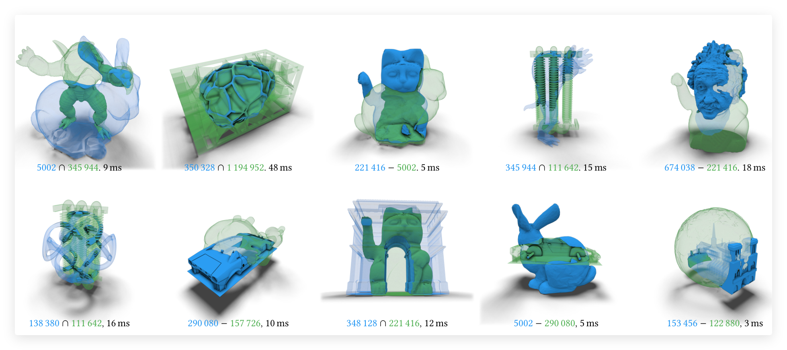

图19. 本方法示例输出：半透明输入的面片数量及时耗统计。模型来自Thingi10K与斯坦福扫描资料库。

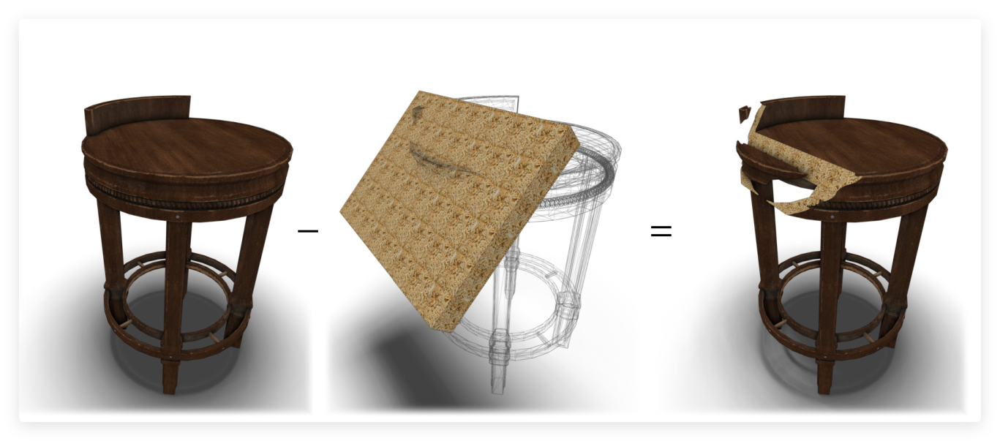

图20. 由于可为每个输出多边形识别对应输入多边形，纹理坐标等属性可轻松从输入传递至输出。

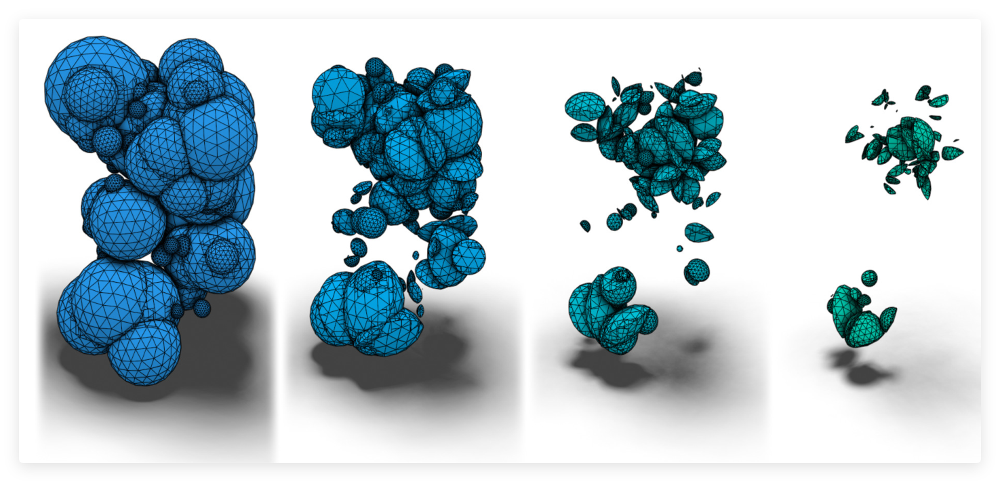

图21. WNV可用于高效实现多种可变参数操作。本示例通过球体集合提取至少包含1、2、3或4个球体的实体（从左至右）。通过计算每个多边形的WNTV，可同时提取所有层级。此含32,000输入三角形的案例耗时15毫秒。

dungbeetle24的787623、adafruit的807591、ye3d的1081535。图20的模型与纹理来自[Sanchez 2021]。

# 参考文献

Marco Attene. 2020. 用于几何构造的间接谓词。计算机辅助设计 126 (2020年9月), 102856. https://doi.org/10.1016/j.cad.2020.102856 

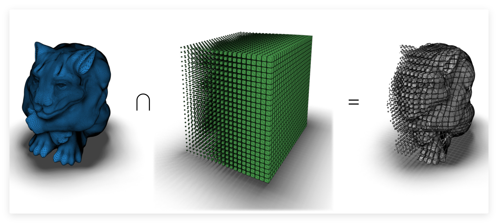

图 22. 即使在密集交互的情况下，我们的方法仍保持高性能。此示例包含约 350,000 个输入三角形，耗时 $43 \mathrm{ms}$。

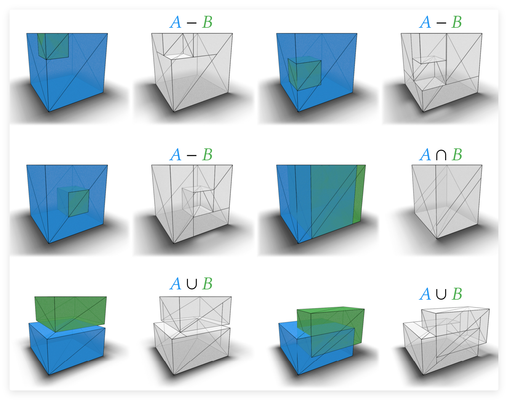

图 23. 各种边角与重叠情况的小型集合。包含共面、精确边线命中之类的挑战。结果以透明方式显示，以证明没有表面被重复生成且内部为空。

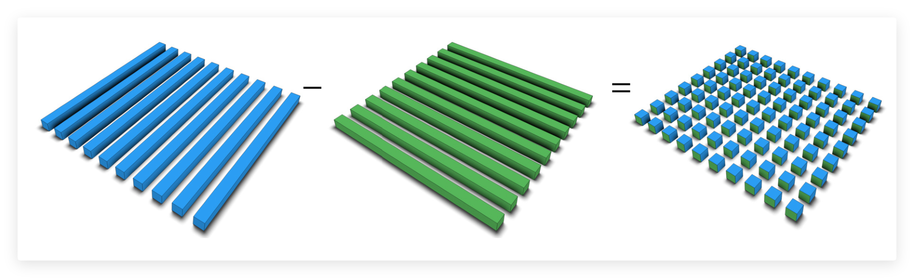

图 24. 10×10 的梁相交产生 100 个立方体。这展示了一个最坏情况配置：线性输入复杂度产生二次方输出。对于 20×20 的梁，我们的方法耗时 $4.5 \mathrm{ms}$，而网格排列耗时 18,018 ms，浮点数网格排列耗时 1556 ms，CGAL 4.12 耗时 6465 ms，CGAL 5.4 耗时 941 ms。非精确方法产生严重损坏的结果。
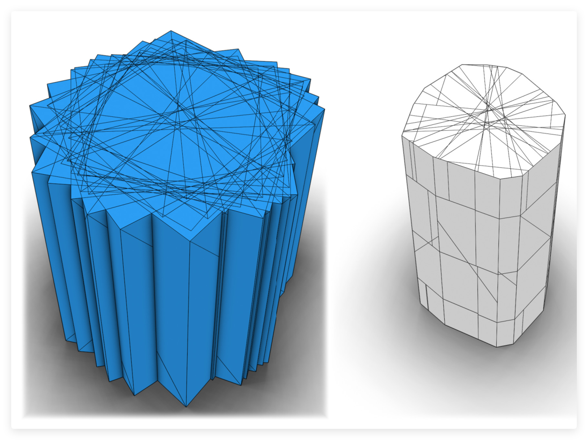

图 25. 20 个共享相同顶面和底面的立方体相交，从而在同一位置产生最多 20 个多边形重叠的区域。此案例极具挑战性，许多优化方法效果不佳。尽管仅包含 240 个三角形，此示例用我们的方法计算耗时 $5.9 \mathrm{ms}$。网格排列耗时 58,280 ms，浮点数网格排列耗时 $5620 \mathrm{ms}$。

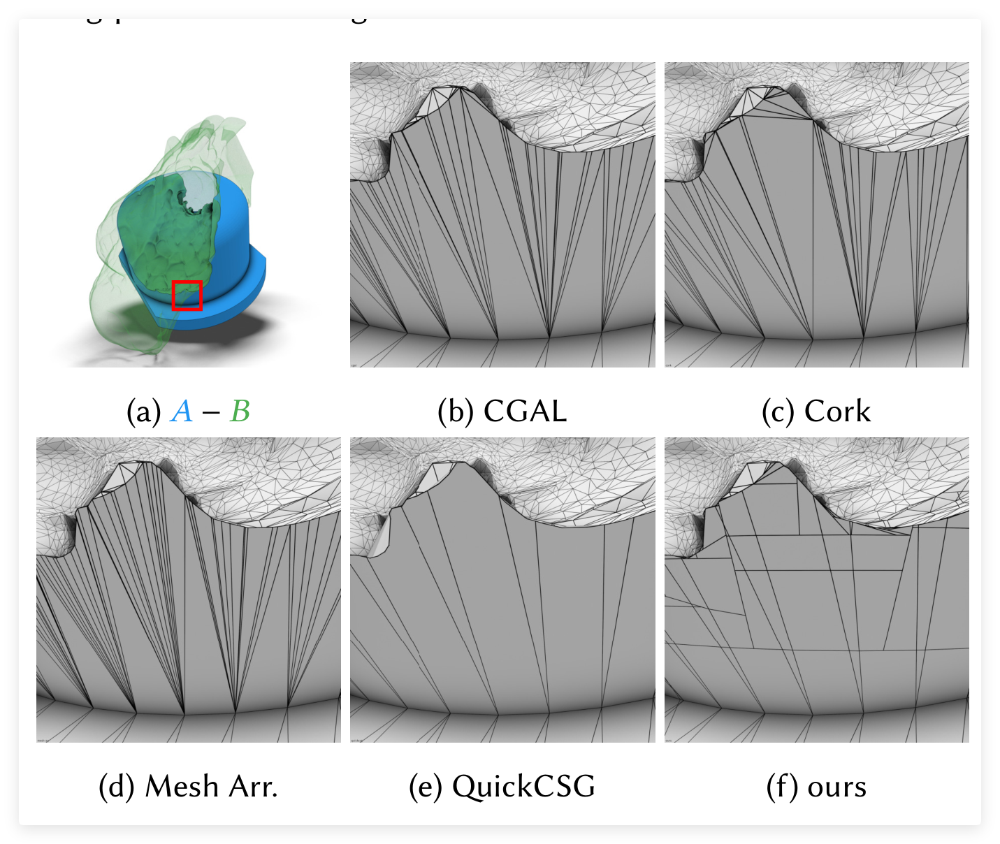

图 26. 网格差值的特写以及各种方法产生的细分结果。CGAL、Cork 和网格排列生成三角剖分，我们生成凸多边形集合，而 QuickCSG 甚至生成凹多边形。